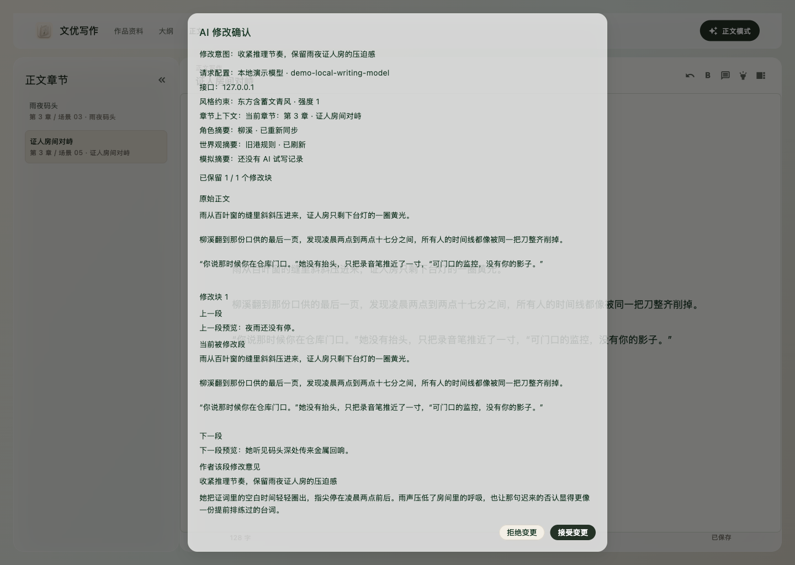

# Novel Writer

Novel Writer 是一个本地优先的长篇小说写作工作台。它把项目、角色、世界观、场景、参考资料和 AI 写作助手放在同一个地方，帮助作者从资料整理、正文起草到改写、审阅、版本保存和通读检查形成一条完整流程。



> **REAL APP SCREENSHOT** — 上图来自 macOS 桌面端运行中的 Workbench，使用临时演示数据和本地演示模型配置，展示 AI 候选稿审阅流程。

当前项目还是开发预览版，暂时没有安装包。普通用户如果想试用，需要先安装 Flutter，然后从源码启动应用。

## 产品定位

`n0vel` 的传播定位是：给长篇小说作者用的本地优先 AI 创作工作台。

它不主打“一键生成小说”，而是强调作者主导的长篇工作流：先管理角色、世界观、场景和伏笔，再让 AI 生成候选稿，最后由作者确认、修订并写入正文。完整推广路线见 [n0vel 推广与增长路线图](docs/growth-roadmap.md)。

## 适合做什么

- 管理多个小说项目。
- 维护角色资料、世界观规则、场景列表和参考材料。
- 在写作工作台中写正文，并让 AI 帮你续写、改写、审阅或润色。
- 在重要改动前保存版本，方便回看或恢复。
- 用阅读模式通读正文，减少编辑界面的干扰。
- 通过导入/导出迁移或备份项目。

## 启动应用

1. 安装 Flutter 3.27 或更新版本。
2. 在终端进入本项目目录。
3. 获取依赖：

```bash
flutter pub get
```

4. 在当前电脑上运行：

```bash
flutter run -d macos
```

如果你使用 Windows 或 Linux，把命令里的 `macos` 换成 `windows` 或 `linux`。当前 Web/Chrome 预览仍受本地 `sqlite3`/`dart:ffi` 依赖限制，建议先用桌面端试用。

## 第一次使用

1. 打开 `Settings`。
2. 在 `Default model` 里填写模型服务：

| 字段 | 填什么 |
| --- | --- |
| Model service | 给服务起一个容易识别的名字，例如 `OpenAI 兼容服务` |
| Base URL | 模型服务的接口地址，很多服务需要以 `/v1` 结尾 |
| Model | 服务商提供的模型名称 |
| API key | 你的模型服务密钥 |

常见 OpenAI 兼容服务的示例 Base URL 和 Model 值见 [OpenAI-compatible provider examples](docs/openai-compatible-providers.md)。这些示例不会包含真实密钥；你需要使用自己的 API key。

3. 超时和并发设置先保持默认；只有请求经常超时或服务商有限流时再调整。
4. 点击连接测试，通过后保存。

应用会把项目资料保存在本机。使用 AI 功能时，请求提示词和必要上下文会发送给你配置的模型服务。

想先了解推荐的项目结构，可以查看 `test/fixtures/sample_project_fixture.json`。这个小型虚构示例包含角色、世界规则、场景和风格说明，不含真实密钥、私人文本或受版权保护的原文。

## 示例项目

不确定怎么填角色、世界观和场景？看一下 [《月潮档案》示例项目](docs/sample-project-moon-tide.md)，它展示了一个已填充资料的长篇小说工作台。

## 推荐写作流程

1. 在项目架上新建或打开一个项目。
2. 先补齐基础资料：

| 资料 | 建议内容 |
| --- | --- |
| Characters | 角色姓名、身份、关系、稳定性格和禁忌设定 |
| Worldbuilding | 世界规则、地点、组织、能力体系和限制 |
| Scenes | 章节或场景标题、目标、冲突和收束方向 |
| Style / References | 想参考的文风、示例片段或写作要求 |

3. 进入 Workbench 正常写正文。
4. 需要 AI 帮忙时打开 AI 工具：

| 操作 | 适合场景 |
| --- | --- |
| Continue | 从当前正文继续往下写 |
| Rewrite | 改写选中的段落 |
| Add selection | 把选中文本作为上下文，让请求更精确 |

5. AI 生成的内容会先作为候选结果出现，确认后再写入正式草稿。
6. 大改前保存版本。
7. 想检查阅读节奏时进入 Reading。
8. 需要备份或迁移时使用 Import / Export。

## 主要页面

| 页面 | 用途 |
| --- | --- |
| Shelf | 创建、打开和切换项目 |
| Workbench | 正文写作、AI 辅助、反馈和版本操作 |
| Characters | 角色资料和一致性材料 |
| Worldbuilding | 世界观、地点、组织和规则 |
| Scenes | 场景列表、标题、摘要和顺序 |
| Style / References | 参考资料和风格要求 |
| Audit / Review tasks | 检查问题和后续修订项 |
| Versions | 草稿快照和版本回看 |
| Reading | 低干扰通读 |
| Import / Export | 项目迁移和备份 |
| Settings | 模型服务、密钥、主题、超时和路由设置 |

## 常见问题

| 问题 | 先检查什么 |
| --- | --- |
| AI 请求立刻失败 | API key 是否填写并保存 |
| 连接不上模型服务 | Base URL 是否正确，是否需要 `/v1` |
| 提示模型不存在 | Model 是否和服务商后台里的模型 ID 完全一致 |
| 请求很慢或超时 | 适当调大接收超时，或降低并发上限 |
| AI 没有直接覆盖正文 | 这是预期行为，生成结果需要先确认再写入草稿 |
| 生成时修改了角色或世界观 | 当前运行可能仍使用启动时的快照；需要最新资料时重新发起生成 |

更详细的安装排查、平台差异和模型配置说明见 [试用准备与已知问题](docs/trial-readiness.md)。

## 试用反馈

现阶段最需要验证的是：谁会用、为什么用、能否成功跑起来、是否能生成第一份候选稿、作者是否愿意采纳或继续反馈。

如果你是小说作者或 AI 写作爱好者，欢迎用 [Author feedback issue 模板](.github/ISSUE_TEMPLATE/author-feedback.yml) 反馈：

- 你的写作类型和最大痛点。
- 是否成功安装并创建项目。
- 是否填写角色、世界观或场景。
- 是否完成一次 AI 生成或改写。
- 候选稿确认流程是否比直接覆盖正文更安心。
- 哪个功能最影响你继续使用。

## 给开发者

常用检查：

```bash
flutter analyze
flutter test
```

架构说明在 `docs/architecture.md`，产品需求在 `docs/prd.md`。

推广素材位于 `docs/assets/`，详细清单和真实性标签见 [ASSET_MANIFEST.md](docs/assets/ASSET_MANIFEST.md)：

| 用途 | 文件 | 说明 |
| --- | --- | --- |
| README 真实截图 | `real-desktop-ai-review.png` | REAL APP SCREENSHOT |
| README 旧预览占位图 | `novel-writer-preview.png` | MOCK PLACEHOLDER |
| GitHub social preview | `social-preview.png` | MOCK PLACEHOLDER |
| 视频标题/CTA/摘要卡 | `title-card.png` `cta-card.png` `summary-card.png` | STATIC DESIGN ASSET |
| 视频章节叠加图 | `section-overlay-01.png` ~ `section-overlay-05.png` | STATIC DESIGN ASSET |

除 `real-desktop-ai-review.png` 外，其余素材均为程序生成的静态设计占位图或视频叠加图，不应当被描述为真实应用截图。

所有持久化内容更新都要在 GitHub issue 中留下记录。当前规则记录在 [issue #2](https://github.com/changw98ic/n0vel/issues/2)，README 基础更新记录在 [issue #3](https://github.com/changw98ic/n0vel/issues/3)，当前架构分析报告在 [issue #4](https://github.com/changw98ic/n0vel/issues/4)，推广与私测准备记录在 [issue #5](https://github.com/changw98ic/n0vel/issues/5)，真实桌面截图记录在 [issue #6](https://github.com/changw98ic/n0vel/issues/6)。
