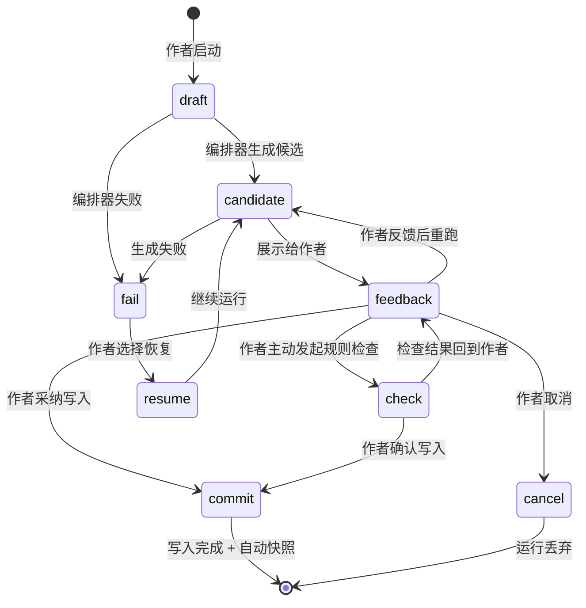

# 最新架构图

更新日期：2026-05-12

## 1. 总览

```mermaid
flowchart LR
    subgraph Routes["UI Routes / Pages"]
        Shelf["shelf\nProjectListPage"]
        Workbench["workbench\nWorkbenchShellPage"]
        Characters["characters\nCharacterLibraryPage"]
        World["worldbuilding\nWorldbuildingPage"]
        Scenes["scenes\nSceneManagementPage"]
        Style["style\nReferenceMaterialsPage"]
        Audit["audit\nAuditCenterPage"]
        Versions["versions\nVersionHistoryPage"]
        ImportExport["import_export\nProjectImportExportPage"]
        Settings["settings\nSettingsShellPage"]
        WorkSettings["work_settings_hub\nWorkSettingsHubPage"]
        Revision["revision_hub\nRevisionHubPage"]
        Production["production_board\nProductionBoardPage"]
        ReviewTasks["review_tasks\nReviewTaskPage"]
        Reading["reading\nReadingModePage"]
        Sandbox["sandbox\nSandboxMonitorPage"]
    end

    subgraph State["App State / Stores"]
        Workspace["AppWorkspaceStore"]
        Draft["AppDraftStore"]
        VersionsStore["AppVersionStore"]
        Context["AppSceneContextStore"]
        Outline["StoryOutlineStore"]
        Generation["StoryGenerationStore"]
        RunStore["StoryGenerationRunStore"]
        SettingsStore["AppSettingsStore"]
        Simulation["AppSimulationStore"]
        EventLog["AppEventLog"]
    end

    subgraph Providers["Riverpod Provider Surface"]
        ProviderScope["ProviderScope override"]
        RegistryProvider["serviceRegistryProvider"]
        StoreProviders["NotifierProvider store adapters"]
        InfraProviders["AppEventBus/AppEventLog/LLM providers"]
    end

    subgraph Runtime["Runtime / Services"]
        Registry["ServiceRegistry bridge"]
        Orchestrator["PipelineStageRunnerImpl"]
        Roleplay["SceneRoleplayRuntime"]
        Resolver["SceneStateResolver"]
        Review["SceneReviewCoordinator"]
        Transfer["ProjectTransferService"]
        Llm["AppLlmClient + provider adapters"]
        Memory["Story / Character / Roleplay memory stores"]
    end

    subgraph Storage["Local Persistence"]
        Authoring["authoring.db / project stores"]
        SettingsFile["settings.json + key material"]
        Telemetry["telemetry.db + JSONL"]
        Files["export package / local files"]
    end

    External["External model endpoints"]

    Routes --> State
    Routes --> Providers
    ProviderScope --> RegistryProvider
    RegistryProvider --> Registry
    StoreProviders --> RegistryProvider
    InfraProviders --> RegistryProvider
    StoreProviders --> State
    InfraProviders --> Runtime
    State --> Storage
    Draft --> Orchestrator
    Context --> Orchestrator
    Generation --> Orchestrator
    RunStore --> Orchestrator
    Orchestrator --> Roleplay
    Orchestrator --> Resolver
    Orchestrator --> Review
    Orchestrator --> Memory
    Orchestrator --> Llm
    Llm --> External
    Transfer --> Files
    Transfer --> Authoring
    EventLog --> Telemetry
    SettingsStore --> SettingsFile
```



## 2. Route Surface Catalog

### 2.1 Core Writing Flow

| Route | Page Class | 用途 |
| --- | --- | --- |
| `shelf` | `ProjectListPage` | 项目入口、项目切换、新建项目 |
| `workbench` | `WorkbenchShellPage` | 正文编辑、AI 写作、主工作入口 |
| `scenes` | `SceneManagementPage` | 场景维护与切换 |
| `characters` | `CharacterLibraryPage` | 角色资料维护 |
| `worldbuilding` | `WorldbuildingPage` | 世界与规则维护 |
| `style` | `ReferenceMaterialsPage` | 参考资料与风格资料入口 |

### 2.2 Review / Production Flow

| Route | Page Class | 用途 |
| --- | --- | --- |
| `audit` | `AuditCenterPage` | 问题检查与一致性复核 |
| `revision_hub` | `RevisionHubPage` | 修订动作聚合 |
| `review_tasks` | `ReviewTaskPage` | 待审任务与状态跟踪 |
| `production_board` | `ProductionBoardPage` | 项目推进与产出编排 |
| `versions` | `VersionHistoryPage` | 版本回看与恢复 |

说明：这些 surface 代表当前实现仍保留的辅助能力；产品默认路径应优先在 `workbench` 的结束态通过用户反馈或一次性规则检查完成判断、修订和写入，避免将作者默认转入独立后台式页面。

### 2.3 System / Utility Flow

| Route | Page Class | 用途 |
| --- | --- | --- |
| `import_export` | `ProjectImportExportPage` | 工程迁移与导出 |
| `settings` | `SettingsShellPage` | Provider、密钥与全局设置 |
| `work_settings_hub` | `WorkSettingsHubPage` | 工作流相关设置中心 |
| `reading` | `ReadingModePage` | 低干扰通读 |
| `sandbox` | `SandboxMonitorPage` | 模拟过程与运行快照回看 |

## 3. 主数据流

### 3.1 项目数据流

1. UI 页面通过 Riverpod provider 读取当前项目上下文：`appWorkspaceStoreProvider`、`appDraftStoreProvider`、`appVersionStoreProvider`、`appSceneContextStoreProvider`、`appSettingsStoreProvider`、`appSimulationStoreProvider`、`storyGenerationRunStoreProvider` 等是当前公开入口。
2. 这些 store 把项目、场景、角色、世界观、草稿和版本写入本地持久化。
3. 项目切换后，project-scoped store 恢复到对应项目快照。

### 3.2 Riverpod 与服务桥接

1. 根 `ProviderScope` 在默认生产启动路径中仍通过 `appProviderOverridesForRegistry()` 共享 `ServiceRegistry` 已拥有的单例，避免迁移期产生重复实例。
2. `appEventBusProvider`、`appEventLogProvider`、`appLlmClientProvider`、`appLlmRequestPoolProvider`、`databaseProvider`、DB-backed stores、核心 stores、feature stores 与 `StoryGenerationRunStore` 均已具备原生 Riverpod 默认构造路径。
3. `AppSettingsStore`、`AppWorkspaceStore` 与 `StoryGenerationRunStore` 使用专属 `NotifierProvider` 桥接现有 `Listenable` 通知；旧的通用 `RegistryStoreNotifier` 已移除。
4. 测试可通过 provider-first bootstrap smoke path 在不覆盖 `serviceRegistryProvider` 的情况下解析主要 store；生产切换仍需 crash recovery 与持久化初始化覆盖后再执行。

### 3.3 AI 生成数据流

1. 工作台与场景上下文把当前写作状态交给 `PipelineStageRunnerImpl`。
2. 编排器调用 `SceneRoleplayRuntime`、`SceneStateResolver`、`SceneReviewCoordinator` 和记忆层。
3. 外部模型通信统一经 `AppLlmClient + provider adapters` 发出。
4. 运行状态、阶段消息、失败摘要和完成快照通过 `StoryGenerationRunStore` 与事件日志回流到 UI。

### 3.4 配置与导出数据流

1. `AppSettingsStore` 管理 provider、模型、密钥、主题和超时。
2. 设置数据写入本地设置文件，不混入项目正文数据。
3. `ProjectTransferService` 负责导入导出，把项目数据组织为导出包。

## 4. 边界规则

- Local-first：项目主数据、运行快照和配置均可在本地恢复。
- Author-in-the-loop：任何会改动正文的 AI 结果都必须先回到作者确认。
- Feedback-driven closure：工作流结束后优先由用户反馈或用户主动发起的规则检查来决定下一步，只有少数复杂问题才进入后续跟踪。
- Sandbox is adjacent：`sandbox` 是工作台的过程视图，正文真源仍由 `workbench` 与 `AppDraftStore` 承担。
- Reading is adjacent：`reading` 是低干扰消费视图，不承担编辑真源职责。
- External AI only：外部端点负责推理与生成，不负责持久化项目主状态。

## 5. 工作流运行合约

### 5.1 运行生命周期



阶段定义：

| 阶段 | 含义 | 正文状态 |
| --- | --- | --- |
| `draft` | 工作流已启动，编排器准备中 | 不变 |
| `candidate` | 编排器产出候选正文 | 不变，候选独立保存 |
| `feedback` | 候选已展示，等待作者决策 | 不变 |
| `check` | 作者发起规则检查，检查结果保留在运行内 | 不变 |
| `commit` | 作者采纳候选，写入正文并自动快照 | 更新为采纳内容 |
| `fail` | 运行中途失败，保存已完成的中间状态 | 不变 |
| `cancel` | 作者主动取消，运行临时数据可丢弃 | 不变 |
| `resume` | 作者选择从 `fail` 恢复，继续未完成的运行 | 不变 |

### 5.2 持久化模型

| 数据类别 | 持久化时机 | 可恢复性 | 说明 |
| --- | --- | --- | --- |
| 项目主数据（角色/世界观/场景/参考资料） | 立即 | 永久 | `authoring.db` |
| 正式草稿 | 立即 | 永久，带版本 | `authoring.db` |
| 自动快照 | 写入后立即 | 永久 | `authoring.db` |
| 配置（provider/密钥/主题/超时） | 立即 | 永久 | `settings.json` |
| 运行快照（run metadata + phase + candidate ref） | 阶段转换时立即 | 可恢复至最近阶段 | `authoring.db` |
| 候选正文 | 生成后立即 | 运行生命周期内可恢复 | `authoring.db`（run-scoped） |
| 规则检查结果 | 检查完成后立即 | 运行生命周期内可恢复 | `authoring.db`（run-scoped） |
| 运行日志/事件 | 实时追加 | 可追溯 | `telemetry.db + JSONL` |
| 设置/资料快照（运行启动时读入） | 不持久化 | 一次性 | 运行内存态，运行结束后释放 |

### 5.3 数据隔离模型

```
项目主数据 ──────────────────────────────────────
│  角色 / 世界观 / 场景 / 参考资料 / 正式草稿
│  ← 写入唯一路径：作者采纳(candidate) → commit
│  ← 读取路径：运行启动时快照读入
└──────────────────────────────────────────────────

运行 A（章节 3）         运行 B（章节 5）
├─ candidate_A           ├─ candidate_B
├─ check_result_A        ├─ check_result_B
├─ log_A                 ├─ log_B
└─ snapshot_A（阶段状态） └─ snapshot_B（阶段状态）
     ↑                        ↑
     范围：run A + 章节 3      范围：run B + 章节 5
```

隔离规则：

1. 候选正文、规则检查结果、运行日志的作用域为单个运行 + 单个章节/项目，不同运行之间互不可见。
2. 项目主数据的唯一写入路径是作者在 `commit` 阶段采纳候选；运行内任何中间产物不直接修改主数据。
3. 设置和项目资料在工作流启动时以快照形式读入运行内存，运行期间不受作者中途修改的影响。
4. 同一章节同一时刻只允许一个活跃运行；新运行必须在前一运行到达 `commit`、`cancel` 或 `fail`（作者选择丢弃）后才能启动。

### 5.4 边界情况处理

| 场景 | 系统行为 | 作者体验 |
| --- | --- | --- |
| 反馈后重跑 | 创建新候选，旧候选保留在运行历史中，不覆盖 | 看到新候选，可对比历史候选 |
| 中途关闭应用 | 运行快照已持久化，重新打开时检测到未完成运行 | 看到恢复提示，选择继续或丢弃 |
| 规则检查失败 | 检查结果保留在运行结束态，标记失败项 | 看到失败摘要，自行决定是否继续写入 |
| 源内容在运行期间被外部修改 | 运行使用启动时的快照继续，`commit` 前检测源变更 | 看到源已变更提示，确认后才写入 |
| 取消运行 | 运行进入 `cancel`，临时数据标记为可清理 | 取消确认后返回草稿编辑 |
| 从失败恢复 | 从最近持久化的阶段快照恢复，已完成的步骤不重跑 | 看到恢复进度，从断点继续 |
| 多个并发运行 | 系统拒绝在同一章节启动第二个运行 | 提示需先处理当前运行 |

## 6. UI Source of Truth

- 当前唯一 UI 稿：`editor.pen`
- 本文档与 [最新 PRD](/Users/chengwen/dev/novel-wirter/docs/prd.md) 一起定义产品事实来源。
