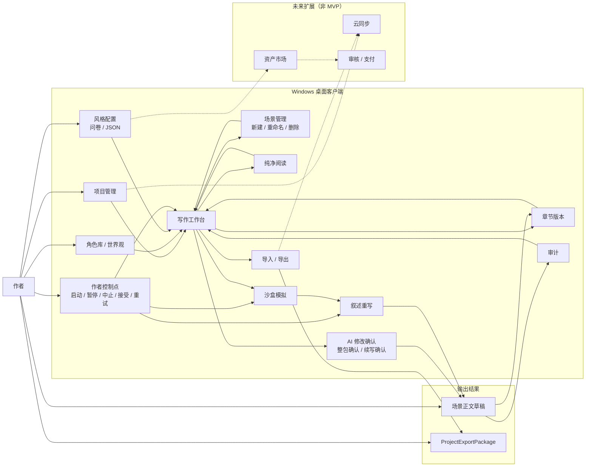

# MVP 架构图

本文档包含两张架构图：

- 图 A：产品汇报型架构图
- 图 B：工程实现型架构图

二者都严格遵守 MVP 边界，不把云同步、资产市场、审核支付写入主流程。

## 图 A：产品汇报型架构图

阅读说明：

- 这张图从作者工作流出发，强调”输入什么、系统做什么、作者在哪里介入、最终得到什么”。
- MVP 的主链路有 10 个环节：项目管理、资料建模、风格配置、写作工作台、场景管理、AI 修改确认、沙盒模拟、叙述重写、审计、导出包。
- `场景管理`（新建 / 重命名 / 删除场景）是工作台内资料面板的邻接操作，在工作台内完成，不跳出独立页面。
- `AI 修改确认`（整包确认 + 续写确认）是 AI 修改结果回传作者的必经交互，确认后才会生成正文草稿和章节版本。
- `章节版本` 与 `纯净阅读` 属于写作工作台邻接视图，承接版本核对与低干扰通读，不改变主成文链路。
- 作者在 MVP 中至少保有五类控制权：资料编辑、模拟启动、模拟中止、正文接受/拒绝、局部重写。
- 云同步、资产市场、审核支付只作为虚线扩展能力出现，不参与 MVP 成文主流程。

## 图 B：工程实现型架构图

```mermaid
flowchart TB
    subgraph UI["Flutter UI"]
        ProjectPage["项目列表页"]
        WorkbenchPage["写作工作台"]
        SandboxPage["Sandbox Monitor\n工作台模态"]
        SceneMgmtPage["场景管理\n工作台内对话框"]
        AIRivPage["AI 修改确认\n工作台内弹窗"]
        CharacterPage["角色库页"]
        WorldPage["世界观页"]
        StylePage["风格面板页"]
        AuditPage["审计中心页"]
        VersionPage["章节版本页"]
        ImportExportPage["工程导入导出页"]
        SettingsPage["设置与 BYOK 页"]
        ReadingPage["纯净阅读态"]
    end

    subgraph State["Riverpod 状态层"]
        ProjectState["projectProvider"]
        SceneState["sceneDraftProvider(sceneId)"]
        SceneMgmtState["sceneManagementProvider(chapterId)"]
        RunState["simulationRunProvider(runId)"]
        LogState["sandboxEventStreamProvider(runId)"]
        CharacterState["characterProvider(characterId)"]
        WorldState["worldNodeProvider(nodeId)"]
        StyleState["styleProfileProvider(projectId)"]
        SettingsState["providerConfigProvider()"]
        AuditState["consistencyReportProvider(scopeId)"]
        VersionState["versionHistoryProvider(chapterId)"]
        TransferState["projectTransferProvider(projectId)"]
        ReadingState["readingModeProvider(sceneId)"]
    end

    subgraph Storage["本地持久化"]
        SQLite["Drift + SQLite\n隐藏数据库模式"]
        Files["本地文件系统\nstyle-profile.json / 导出包"]
        Secure["本地安全存储\nAPI Key"]
    end

    subgraph Runtime["MVP 运行时"]
        Llm["LlmProviderAdapter\nBYOK"]
        StyleEngine["StyleEngineAdapter"]
        Orchestrator["Scene Orchestrator"]
        StateMachine["World State Machine"]
        Narrator["Narrator"]
        ExportService["ProjectExportService"]
    end

    subgraph Artifact["工程产物"]
        Draft["SceneDraft"]
        StyleProfile["StyleProfile"]
        InteractionLog["InteractionLog"]
        Snapshot["WorldStateSnapshot"]
        ExportPackage["ProjectExportPackage"]
    end

    subgraph AuthorInput["作者输入"]
        StyleForm["风格问卷"]
        StyleJson["StyleProfile JSON"]
    end

    subgraph External["外部模型服务"]
        ModelAPI["OpenAI-compatible API"]
    end

    subgraph Future2["未来扩展（非 MVP）"]
        Sync["SyncServiceAdapter"]
        Registry["AssetRegistryAdapter"]
        Moderation["ReviewModerationAdapter"]
    end

    ProjectPage --> ProjectState
    WorkbenchPage --> SceneState
    WorkbenchPage --> CharacterState
    WorkbenchPage --> WorldState
    WorkbenchPage --> StyleState
    WorkbenchPage --> RunState
    WorkbenchPage --> SceneMgmtState
    WorkbenchPage --> AIRivPage
    SandboxPage --> RunState
    SandboxPage --> LogState
    SceneMgmtPage --> SceneMgmtState
    AIRivPage --> SceneState
    CharacterPage --> CharacterState
    WorldPage --> WorldState
    StylePage --> StyleState
    AuditPage --> AuditState
    VersionPage --> VersionState
    VersionPage --> SceneState
    ImportExportPage --> TransferState
    SettingsPage --> SettingsState
    ReadingPage --> ReadingState

    ProjectState --> SQLite
    SceneState --> SQLite
    SceneMgmtState --> SQLite
    RunState --> SQLite
    LogState --> SQLite
    CharacterState --> SQLite
    WorldState --> SQLite
    StyleState --> SQLite
    SettingsState --> SQLite
    SettingsState --> Secure
    AuditState --> SQLite
    VersionState --> SQLite
    TransferState --> SQLite
    ReadingState --> SQLite

    StyleForm --> StyleEngine
    StyleJson --> StyleEngine
    StyleEngine --> StyleProfile
    StyleProfile --> SQLite

    SceneState --> Orchestrator
    CharacterState --> Orchestrator
    WorldState --> Orchestrator
    StyleProfile --> Orchestrator
    Orchestrator --> Llm
    Llm --> ModelAPI
    Orchestrator --> InteractionLog
    Orchestrator --> StateMachine
    StateMachine --> InteractionLog
    StateMachine --> Snapshot
    InteractionLog --> SQLite
    Snapshot --> SQLite
    Orchestrator --> Narrator
    Narrator --> Llm
    Narrator --> Draft
    Draft --> SQLite
    VersionState --> Draft
    ReadingState --> Draft

    TransferState --> ExportService
    Files --> ExportService
    SQLite --> ExportService
    ExportService --> ExportPackage
    ExportPackage --> Files

    ProjectState -.-> Sync
    StyleProfile -.-> Registry
    Registry -.-> Moderation
```

阅读说明：

- 这张图强调 MVP 如何在客户端内部运行，所有核心链路都在本地完成。
- 隐藏数据库模式通过 `Drift + SQLite` 实现，正文、角色、世界观、日志、快照都落在本地库中。
- BYOK 调用链固定为：设置页把 `api_key` 写入本地安全存储，把非敏感 Provider 配置与通用偏好写入 SQLite；`LlmProviderAdapter` 读取当前配置后调用 OpenAI-compatible API。
- 风格配置链固定为：作者填写风格问卷或导入 `StyleProfile JSON` -> `StyleEngineAdapter` 校验 / 归一化 -> `StyleProfile` -> SQLite -> 写作工作台组装提示。
- 工作台本身直接消费 `RunState`，以承接 `Simulation Completed`、`Simulation Failed Summary` 等工作台内摘要反馈；`Sandbox Monitor` 在此基础上提供展开后的观察视图。
- `Scene Orchestrator` 负责把导演 / 叙述 / 阶段刷新等多 agent 观测事件写入 `InteractionLog`，`World State Machine` 负责写入动作裁决与 `WorldStateSnapshot`。
- `Character Library`、`Worldbuilding`、`Audit Center`、`Project Import Export` 都属于一等 MVP UI surface，只是在实现层复用共享壳层与本地状态，而不是各自引入新的运行时服务。
- `Sandbox Monitor` 在实现上是挂在工作台上的模态观察面，但在 UI / PRD / 验收层仍属于独立的 canonical surface。
- `Scene Management`（场景管理）是工作台内资料面板的邻接操作，以对话框形式在工作台内完成新建 / 重命名 / 删除场景，不跳出独立页面。其 canonical frame 为 `PIRts`，状态包括 Create Scene、Rename Scene、Delete Scene Confirm、Edit Chapter Label、Edit Summary。
- `AI 修改确认`（AI Revision Confirmation）是工作台内弹窗交互，承载整包确认、逐段排除、续写确认三种模式。确认后结果才写入 `SceneDraft` 并生成章节版本。
- `Chapter Versions` 与 `Reading Mode` 是基于本地 `SceneDraft` 与章节索引构建的工作台邻接视图，不需要单独的云侧运行时。
- 工程导出链固定为：SQLite + 本地文件 -> `ProjectExportService` -> `ProjectExportPackage`。
- `UI Foundation` 是设计交付基线，不属于运行时页面，因此不出现在工程实现图中。
- `SyncServiceAdapter`、`AssetRegistryAdapter`、`ReviewModerationAdapter` 只作为未来扩展占位，不进入 MVP 实现。

## MVP UI Surface Catalog

以下表格将架构图中的节点映射到 `canonical-frame-map.json` 和 `traceability-matrix.md` 中的规范标识，用于验证架构层与 UI/PRD 层的表面一致性。

### Core Pages

Core Pages 是拥有独立 canonical frame、独立 PRD、独立 smoke test 的一等页面。

| 架构节点 | Canonical Page | 主 Frame | Surface 类型 |
| --- | --- | --- | --- |
| 项目列表 | Project List | `nXod8` | 一等页面 |
| 写作工作台 | Writing Workbench | `47nGt` | 一等页面 |
| 角色库 | Character Library | `4KVQe` | 一等页面 |
| 世界观 | Worldbuilding | `dH2Mr` | 一等页面 |
| 风格面板 | Style Panel | `ff8vo` | 一等页面 |
| 审计中心 | Audit Center | `p8Lkt` | 一等页面 |
| 工程导入导出 | Project Import Export | `z0mJ1` | 一等页面 |
| 设置与 BYOK | Settings & BYOK | `DnwrZ` | 一等页面 |

### Adjacent Views

Adjacent Views 是挂在写作工作台上下文中的 canonical surface 或工作台邻接视图，不引入独立云侧运行时。

| 架构节点 | Canonical Page | 主 Frame | Surface 类型 |
| --- | --- | --- | --- |
| 模拟过程弹窗 | Sandbox Monitor | `YTrUo` | 一等 canonical surface（工作台模态） |
| 章节版本 | Chapter Versions | `Ym6ea` | 工作台邻接视图 |
| 纯净阅读 | Reading Mode | `GD63C` | 工作台邻接视图 |
| 场景管理 | Scene Management | `PIRts` | 工作台内对话框 |
| AI 修改确认 | AI Revision Confirmation | `XYBaG` | 工作台内弹窗 |

注：

- Surface 类型定义：
  - "一等页面"：拥有独立 canonical frame、独立 PRD、独立 smoke test 的完整页面。
  - "一等 canonical surface"：在 UI / PRD / 验收层拥有独立表面定义，但在实现层以模态方式承载。
  - "工作台邻接视图"：基于本地 `SceneDraft` 与章节索引构建、不引入独立运行时的视图。
  - "工作台内对话框 / 弹窗"：在工作台内完成的操作，不跳出独立页面。
- `UI Foundation`（`9gEi3`）是设计交付基线，不属于运行时页面，因此不列入上表。
- 图 A 中的"角色库 / 世界观"在架构层归为 `Modeling` 节点，但在 UI/PRD 层是两个独立的一等页面（`4KVQe` 与 `dH2Mr`）。
- 全部 canonical frame ID 与状态列表见 `canonical-frame-map.json` 和 `frame-state-coverage.md`。
