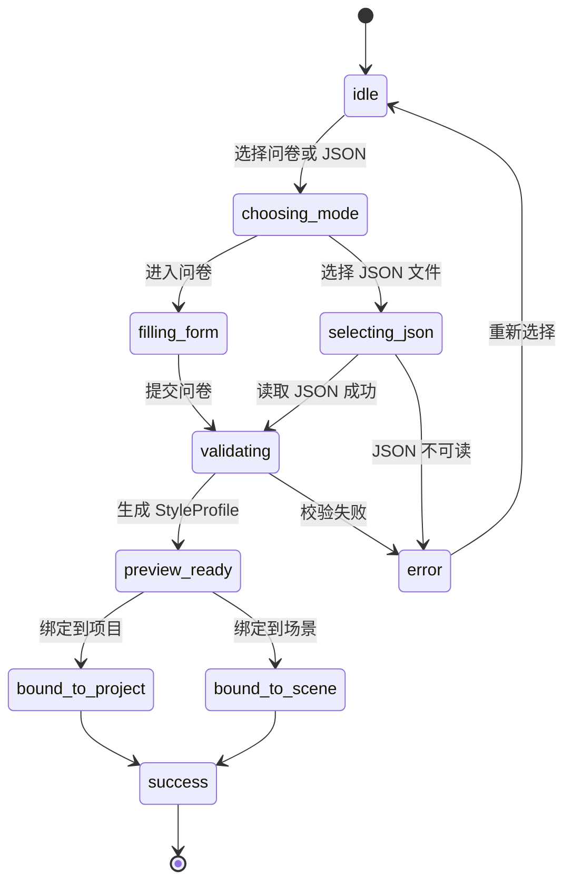
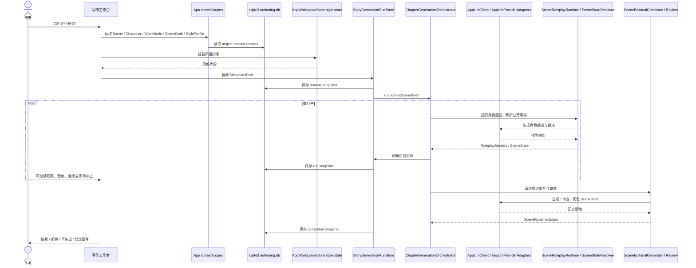
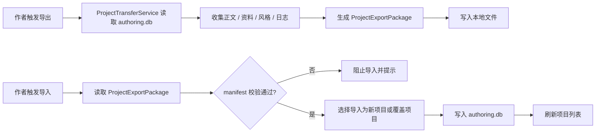

# MVP 核心流程与状态流转

本文档梳理 MVP 的五段主流程，并回答五个核心问题：

- 数据从哪里来
- 在哪一步被修改
- 在哪一步落盘
- 在哪一步调用模型
- 在哪一步允许作者介入

## 1. 项目初始化流程

触发条件：

- 作者首次打开客户端
- 作者在项目列表页点击“新建项目”

前置数据：

- 无现有项目依赖
- 设置页中的 `LlmProviderConfig` 可以为空

核心步骤：

1. 作者输入项目标题、体裁、目标篇幅、叙事视角。
2. 系统创建 `NovelProject`。
3. 系统创建默认卷章骨架与首个 `Scene`。
4. 系统为项目生成初始目录索引与空白 `SceneDraft`。
5. 项目列表页刷新并高亮新项目。

状态变化：

- 页面状态：`ready -> running -> success`
- 项目状态：`draft`
- 当前场景草稿：从不存在变为初始空文本

输出结果：

- 一个可打开的 `NovelProject`
- 默认章节树
- 默认场景与空白草稿

失败 / 异常处理：

- 项目标题为空时阻止提交
- SQLite 写入失败时显示错误并回滚本次创建
- 如存在同名项目，仅提示，不强制阻止

## 2. 资料建模流程

触发条件：

- 作者进入角色库页或世界观页
- 作者在写作工作台中点击“补充资料”

前置数据：

- 已存在 `NovelProject`
- 已有至少一个 `Scene`

核心步骤：

1. 作者创建或编辑 `Character`。
2. 作者填写角色动机、恐惧、误信和心理参数。
3. 作者创建或编辑 `WorldNode` 与 `RuleConstraint`。
4. 作者回到写作工作台，为当前 `Scene` 绑定参与角色、地点、冲突和目标。
5. 系统刷新场景上下文摘要。

状态变化：

- `Character` 与 `WorldNode` 从未创建变为 `ready`
- 当前场景上下文从旧值更新为新值
- 写作工作台上下文摘要重新计算

输出结果：

- 可参与模拟的角色集
- 可引用的世界观规则与地点数据
- 完整的场景卡信息

失败 / 异常处理：

- 角色名为空时阻止保存
- 世界观节点缺少类型时阻止保存
- 删除被场景引用的角色或地点时要求二次确认

## 3. 风格配置流程

触发条件：

- 作者在风格面板页点击“填写风格问卷”
- 作者在风格面板页点击“导入 StyleProfile JSON”
- 作者在写作工作台右侧功能区点击“绑定风格”

前置数据：

- 已存在 `NovelProject`
- 作者已准备好风格偏好
- 若选择 JSON 导入，则本地存在合法的 `StyleProfile JSON` 文件

核心步骤：

1. 作者选择“问卷模式”或“JSON 模式”。
2. 问卷模式下，作者填写体裁、叙事视角、句长倾向、对白密度、描写密度、情绪强度、禁忌表达等字段。
3. JSON 模式下，作者选择本地 `StyleProfile JSON` 文件。
4. `AppWorkspaceStore` 的风格状态逻辑对问卷答案或 JSON 数据进行校验与归一化。
5. 系统生成 `StyleProfile` 预览。
6. 作者选择风格强度：轻度、中度或强。
7. 作者将 `StyleProfile` 绑定到项目或当前场景。
8. 系统保存风格摘要并刷新写作工作台提示上下文。

状态变化：

- 风格面板状态：`ready -> running -> success`
- `StyleProfile`：从不存在变为 `ready`
- 场景上下文：附加风格约束片段

输出结果：

- 一个已保存的 `StyleProfile`
- 项目级或场景级风格绑定

失败 / 异常处理：

- 问卷缺少必填项时阻止生成 `StyleProfile`
- JSON 不合法或缺少必填字段时直接拒绝
- JSON 中 `language` 与项目语言冲突时弹出警告，但允许继续
- JSON 中超出支持范围的字段会被忽略，并在结果区提示

### 风格配置状态图

## 4. 场景创作主流程

触发条件：

- 作者在写作工作台中打开一个 `Scene`
- 作者点击“运行模拟”

前置数据：

- 已存在 `Scene`
- 当前场景已绑定参与角色
- 可选：已绑定 `StyleProfile`
- 可选：设置页已填入有效的 `LlmProviderConfig`

核心步骤：

1. 写作工作台通过 `AppWorkspaceStore`、`AppDraftStore`、`StoryGenerationStore` 读取 `Scene`、`Character`、`WorldNode`、`StyleProfile`、最近 `SceneDraft`。
2. `StoryGenerationRunStore` 为当前场景创建 scene-scope run snapshot，并组装 `SceneBrief`。
3. `ChapterGenerationOrchestrator` 组装场景上下文、角色输入包、记忆检索和 RAG 上下文。
4. `SceneRoleplayRuntime` 通过 `AppLlmClient` / `AppLlmProviderAdapters` 调用外部模型端点，生成角色回合、公开动作、对白、内心和记忆提案。
5. `SceneStateResolver` 与 `SceneReviewCoordinator` 解析回合事实、审查正文与契约完成度，并把状态摘要写回 `StoryGenerationRunSnapshot`。
6. 达到回合上限、场景目标、质量门通过或作者手动中止时，模拟结束。
7. `SceneEditorialGenerator` / `ScenePolishPass` 读取回合、裁定事实与检索胶囊，调用模型生成或润色新的 `SceneDraft`。
8. 作者选择接受、再生成或局部重写正文。
9. 系统保存正文版本并更新版本历史。

状态变化：

- 写作工作台状态：`idle -> context_ready -> simulating -> narrating -> reviewing -> completed`
- `SimulationRun`（实现为 `StoryGenerationRunSnapshot`）：`idle -> simulating -> completed`
- `SceneDraft`：新增版本
- `WorldStateSnapshot`（实现为 `RoleplaySession` / `SceneState` 摘要）：按回合增加

输出结果：

- 一次完整的 `SimulationRun` / `StoryGenerationRunSnapshot`
- 一组 `InteractionLog` / run messages / telemetry events
- 一组 `WorldStateSnapshot` / roleplay session facts
- 一版新的 `SceneDraft`

失败 / 异常处理：

- 缺少参与角色时禁止启动模拟
- API Key 未配置时跳转设置页
- 模型调用失败时保留已生成日志，不生成正文
- 状态机裁决失败时把失败原因写入日志并继续下一回合
- 作者手动中止时保留已完成回合并允许直接叙述重写

作者交互权：

- 运行前：修改场景卡、角色绑定、风格强度、当前正文上下文
- 运行中：查看回合日志、暂停、继续、中止
- 运行后：接受草稿、拒绝草稿、重新叙述、局部重写
- 落盘前：作者未接受时，不将 AI 正文视为最终主草稿

### 场景创作时序图

## 5. 保存与导出流程

触发条件：

- 作者编辑正文
- 作者点击“导出工程”
- 作者点击“导入工程”

前置数据：

- 本地已打开项目
- 导出时至少存在一个 `NovelProject`
- 导入时存在合法的 `ProjectExportPackage`

核心步骤：

1. 正文编辑器在内容变化后自动保存 `SceneDraft`。
2. 系统在模拟完成和手动保存时创建版本快照。
3. 作者在工程导入导出页触发导出。
4. `ProjectTransferService` 从 `authoring.db` 和本地文件系统收集正文、资料、风格、日志和元数据。
5. 系统生成 `ProjectExportPackage`。
6. 导入时，系统先读取包内 `manifest.json` 校验版本兼容性。
7. 作者选择“导入为新项目”或“覆盖同 ID 项目”。
8. 系统完成导入并刷新项目列表。

状态变化：

- 草稿状态：自动保存为最新版本
- 版本状态：新增一条历史记录
- 导出状态：`ready -> running -> success`
- 导入状态：`ready -> running -> success`

输出结果：

- 已保存的 `SceneDraft`
- 新版本历史记录
- 一份 `ProjectExportPackage`

失败 / 异常处理：

- 导出路径不可写时直接失败并提示
- 导入包缺少 `manifest.json` 时阻止导入
- `schema_major` 不兼容时阻止导入
- 同 ID 覆盖导入必须二次确认

### 工程导出 / 导入流程图

## 流程级统一说明

- 数据首次创建主要发生在：项目初始化、资料建模、风格配置。
- 数据主要修改发生在：资料建模、场景创作、保存与导出。
- 数据落盘主要发生在：`sqlite3` 自动保存、模拟回合、叙述重写、工程导出。
- 模型调用只发生在：场景模拟与叙述重写。
- 作者介入点主要发生在：资料建模、风格绑定、模拟启动、模拟暂停 / 继续 / 中止、接受或拒绝正文草稿、局部重写。

## 作者交互权总表

| 阶段 | 作者权利 | 是否属于 MVP |
| --- | --- | --- |
| 项目初始化 | 创建项目、定义体裁与目标 | 是 |
| 资料建模 | 编辑角色、世界观、场景卡 | 是 |
| 风格配置 | 填写问卷或导入 JSON、调整强度、绑定范围 | 是 |
| 模拟前 | 决定是否启动模拟 | 是 |
| 模拟中 | 观察、暂停、继续、中止 | 是 |
| 叙述后 | 接受、拒绝、再生成、局部重写 | 是 |
| 落盘 | 决定是否以当前结果继续主草稿 | 是 |
| 模拟中深度干预 | 直接插入事件或接管角色 | 否 |
