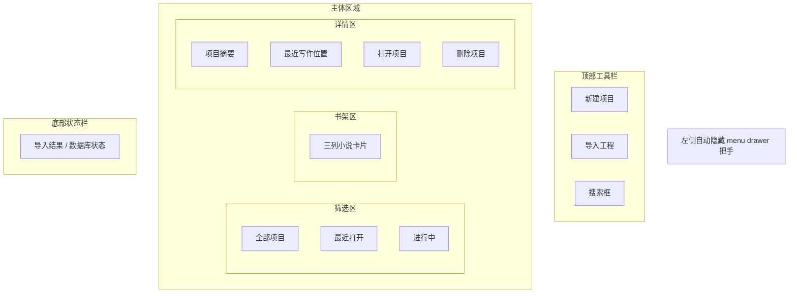

# PRD 01 项目列表页

## 页面目标

作为所有本地小说工程的入口页，负责创建、导入、浏览与继续写作 `NovelProject`。

## 用户任务

- 创建新项目
- 导入工程包
- 搜索和筛选项目
- 浏览最近正在写的作品
- 继续回到上次写作位置
- 删除本地项目

## 核心功能

- 左侧自动隐藏的全局 `menu drawer` 把手
- 顶部工具栏：新建、导入、搜索
- 中间 `书架式项目区`
- 三列扁平小说卡片展示
- 右侧项目详情与主操作
- 底部状态栏：数据库与导入结果

## 页面区域划分

- 左侧全局壳层：自动隐藏 `menu drawer` 把手
- 顶部工具栏：新建项目、导入工程、搜索
- 左侧筛选区：全部项目、最近打开、进行中
- 中间书架区：每行 3 张同尺寸小说卡
- 右侧详情区：项目摘要、最近写作位置、主操作
- 底部状态栏：导入结果、数据库状态

## 关键交互

- 点击小说卡：选中项目并刷新右侧详情区
- 点击“打开项目”：进入写作工作台，并回到该项目最近一次写作位置
- 点击“新建项目”：弹出新建项目对话框
- 点击“导入工程”：进入工程导入导出页并默认切到导入 Tab
- 搜索：按标题、体裁、标签模糊匹配
- 删除项目：弹窗确认后删除本地数据库记录，不删除用户手动导出的工程包

## 状态与数据依赖

依赖类型：

- `NovelProject`
- `Chapter`
- `Scene`
- `ProjectExportPackage`

依赖接口：

- `ProjectExportService`

页面状态：

- `loading`
- `empty`
- `ready`
- `running`
- `error`

## 异常与空状态

- 首次打开或当前无项目：中间主区域进入空书架态，展示“创建项目”与“导入工程”双入口
- 搜索无结果：中间主区域进入“无匹配项目”状态，展示“清空搜索”与“新建项目”
- 导入失败：进入底部错误状态栏，明确展示失败原因，同时保留当前书架与右侧详情
- 数据库读取失败：进入全页错误状态，明确提示项目列表未加载，并提供“重试”与“导入工程”入口
- 删除项目：进入删除确认弹窗，明确说明只删除本地数据库记录，不删除用户手动导出的工程包

## 验收标准

- 中间项目区默认使用书架式三列卡片，不退回列表表格样式
- 同一行中的小说卡片尺寸一致
- 无项目时，不显示空白书架，而是展示明确的创建 / 导入入口
- 搜索无结果时，不显示空白书架，而是展示明确的无结果引导
- 导入失败时，必须保留当前书架内容，不得误清空项目列表或右侧详情
- 数据库读取失败时，不允许继续展示旧项目书架或详情面板，必须切换为全页错误状态
- 删除项目时，必须先经过确认弹窗，且需要明确告知“导出工程包不会被删除”
- 点击“打开项目”后，能回到最近写作的章节与场景
- 搜索结果仅影响中间书架区，不清空右侧详情区
- 删除项目后，已删除项不会继续出现在书架或搜索结果中

## 低保真线框布局

