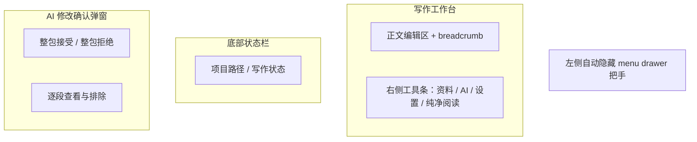

# PRD 02 写作工作台

## 页面目标

作为主工作台，负责完成章节正文编辑、AI 辅助修改、资料查看、纯净阅读跳转和模拟结果查看。

## 用户任务

- 打开并编辑当前章节正文
- 通过 breadcrumb 感知当前项目结构位置
- 通过右侧工具条打开资料、AI、设置和纯净阅读
- 勾选正文中的多处内容并逐段填写修改意见
- 运行 AI 修改并在确认弹窗中接受或拒绝结果
- 打开模拟过程弹窗查看多 agent 输出

## 核心功能

- Markdown 主体编辑
- 自动保存
- 左侧自动隐藏的全局 `menu drawer` 把手（18-20px 宽，展开态 220-240px）
- 顶部 breadcrumb：项目 / 章 / Scene
- 右侧工作工具条（48px 宽）：资料、AI、设置、纯净阅读
- AI 对话框：工具模式、历史区、输入区
- AI 修改确认弹窗：整包确认 + 逐段排除 + 续写确认模式
- 资料面板场景管理：新建 / 重命名 / 删除场景对话框
- 纯净阅读入口
- 模拟过程弹窗入口
- 底部状态栏（28-30px 高）：当前项目路径与写作状态

## 页面区域划分

- 左侧全局壳层：自动隐藏 `menu drawer` 把手
- 中部正文编辑区：章节正文编辑
- 右侧工作工具条：资料、AI、设置、纯净阅读
- 底部状态栏：当前项目路径与写作状态

## 关键交互

- 项目结构导航使用 breadcrumb，不放进 `menu drawer`
- 点击右侧 `资料`：打开资料工具窗口
- 点击右侧 `AI`：打开 AI 工具窗口
- 点击右侧 `纯净阅读`：进入独立 `Reading Mode / Pure Reader`
- 点击“运行模拟”：触发 `SimulationRun`
- 当存在模拟结果时，作者可从工作台打开“模拟过程”弹窗
- `SimulationRun` 完成后，正文区上缘出现轻摘要条，提供“查看模拟过程”入口；底部状态栏继续承担持续状态显示
- `SimulationRun` 失败后，正文区上缘出现失败摘要条，明确说明正文未改动，并提供“查看失败详情”入口；底部状态栏继续保持稳定低干扰的运行状态显示
- 角色卡或世界观资料保存成功后，正文区上缘出现轻同步提示条，并即时刷新相关摘要
- 作者可在正文中勾选多处内容，每处单独填写修改意见
- AI 返回结果后，不直接写入正文，而是进入“AI 修改确认弹窗”
- 确认弹窗中每个修改块都展示：
  - 上一段
  - 当前被修改段
  - 下一段
  - AI 替换内容
  - 作者该段修改意见
- 确认弹窗默认整包接受/拒绝，但允许逐段排除
- 已排除的修改块仍允许在本轮确认中恢复
- 点击”接受变更”后，保留的所有修改一起写入正文，并只生成 `1` 个章节版本
- 点击”拒绝变更”后，正文保持原样，不生成新版本
- AI 续写确认：当 AI 返回的是续写而非局部替换时，进入续写确认模式，整段续写内容作为一个确认块展示，作者可接受或拒绝
- AI 接受变更写入失败：进入错误状态，明确说明写入失败，正文未改动，不生成新版本，并提示重试或返回正文
- 资料面板场景管理：作者可在资料面板中新建场景、重命名场景、删除场景（含确认对话框）
- AI 快捷面板配置读取失败：进入错误状态，提示读取 AI 配置失败，并引导前往设置页检查
- AI 快捷面板配置写入失败：进入错误状态，提示保存 AI 配置失败，并引导重试或前往设置页
- AI 配置恢复成功：配置读取失败后自动恢复成功时，进入就绪态，AI 功能恢复可用

## 状态与数据依赖

依赖类型：

- `NovelProject`
- `Chapter`
- `Scene`
- `Character`
- `WorldNode`
- `StyleProfile`
- `SimulationRun`

依赖接口：

- `LlmProviderAdapter`
- `StyleEngineAdapter`
- `Scene Orchestrator`
- `World State Machine`

页面状态：

- `idle`
- `context_ready`
- `editing`
- `ai_reviewing`
- `simulating`
- `completed`
- `failed`

## 异常与空状态

- 场景未绑定角色：禁用“运行模拟”并提示补充资料
- 角色引用已失效：进入轻阻断提示态，正文可继续编辑，但角色摘要与模拟入口失效
- 世界观引用已失效：进入轻阻断提示态，正文可继续编辑，但地点摘要、规则约束与模拟条件失效
- API Key 未配置：点击 AI 操作时进入工作台内阻塞弹窗，并引导跳转设置与 BYOK 页
- 模拟不存在：进入“尚无 SimulationRun”轻提示状态，不展示模拟过程弹窗，仅保留运行入口
- AI 修改失败：不改正文，进入工作台内错误弹窗状态，并提示返回正文或调整上下文后重试
- 作者拒绝整包修改：不改正文，不生成版本
- AI 修改块已全部排除：禁止提交，并提示至少保留 `1` 个修改块
- 多处选区重叠：进入工作台内阻塞弹窗，阻止提交 AI 修改请求
- AI 接受变更写入失败：进入错误弹窗状态，明确说明写入失败、正文未改动、未生成新版本，并提示重试或返回正文
- AI 快捷面板配置读取失败：AI 面板进入错误态，提示配置读取失败，引导前往设置页检查
- AI 快捷面板配置写入失败：AI 面板进入错误态，提示配置保存失败，引导重试或前往设置页
- AI 配置恢复成功：配置读取失败后自动恢复成功，AI 面板恢复就绪态
- 资料面板场景操作：支持新建场景、重命名场景、删除场景（含确认对话框），操作失败时给出明确错误提示

## 验收标准

- 工作台默认态只保留正文、左侧隐藏 menu 把手、右侧工具条和底部状态栏
- breadcrumb 清楚表达项目结构位置
- 正文编辑区必须保持最高视觉权重，AI 操作区可见但不能压过正文主区
- 场景未绑定角色时，正文仍可编辑，但必须明确提示“模拟不可用”
- 角色引用已失效时，必须明确提示“正文可继续，但需要重新绑定角色后才能恢复摘要与模拟”
- 世界观引用已失效时，必须明确提示“正文可继续，但需要重新绑定地点 / 规则后才能恢复约束与模拟”
- API Key 未配置时，必须明确阻止 AI 操作，并提供“前往设置”入口
- 尚无 SimulationRun 时，必须明确提示“暂无可查看的模拟记录”，但不能打断正文编辑
- `SimulationRun` 完成或失败后，工作台必须把结果回传为轻摘要条，而不是强制跳出到独立页面
- 顶部轻摘要条只负责一次性结果回传与后续动作入口，底部状态栏负责持续状态与写作状态显示
- 资料修改同步到工作台时，必须刷新相关摘要，但不能改变正文、滚动位置或光标锚点
- AI 修改不直接高亮写入正文，必须先进入确认弹窗
- AI 修改失败时，必须明确说明“正文未改动，且不会生成新版本”
- 多处选区重叠时，必须明确说明当前请求未发出，并引导用户取消或合并重叠选区
- 已排除的修改块必须提供恢复入口，且恢复后仍归属同一轮确认
- 多处选区可分别填写修改意见
- 逐段排除后仍按整轮提交生成 `1` 个章节版本
- 当所有修改块都被排除时，确认弹窗必须阻止提交并明确提示
- `接受变更`、`拒绝变更`、`局部重写` 必须保持独立可见，不得折叠进二级菜单
- 底部状态与模拟反馈区必须稳定、低干扰、易扫读，不得退化成持续滚动的日志墙
- 接受 AI 结果后返回当前正文继续编辑，不跳出工作台
- 纯净阅读从工作台进入，退出后回到进入前的编辑位置
- AI 续写结果必须作为整段确认块展示，不允许直接追加写入正文
- AI 接受变更写入失败时，必须明确说明正文未改动且未生成新版本
- AI 快捷面板配置读取 / 写入失败时，必须引导前往设置页检查
- AI 配置自动恢复成功后，AI 功能必须无缝恢复可用
- 资料面板场景对话框（新建 / 重命名 / 删除）必须在工作台内完成，不跳出独立页面
- 删除场景必须经过确认对话框，防止误操作

## UI 设计标准约束

本页面必须遵守以下已固定的 UI 设计基线（来源：`ui-design-standards.md`）：

**页面级规则（§9.1）**：正文编辑区是视觉主角，占最大面积和最高焦点；AI 操作区位于右侧次级区，可见但不压过正文；接受 / 拒绝 / 局部重写必须独立可见，不得折叠进更多菜单；底部模拟日志区必须稳定、低干扰、易扫读。

**布局基线（§2）**：左侧 menu handle 18-20px，展开态 220-240px；右侧工具条 48px，右侧工具窗口 300-320px；底部状态栏 28-30px 高。

**色彩与边框（§3, §5.2）**：正文编辑区边框必须弱于右侧 AI 操作分区；主强调色只用于当前激活项、主按钮、链接态、关键状态反馈。

**组件状态（§6）**：接受草稿使用 `Primary` 按钮，拒绝草稿使用 `Danger` 按钮；重新叙述、局部重写、暂停 / 继续 / 中止使用 `Secondary` 或 `Tertiary` 按钮；同一区域最多一个 `Primary` 按钮；AI 历史列表遵循 List/Row 统一状态（default / hover / selected / disabled）。

**动效（§7）**：草稿接受 / 拒绝反馈 220-300ms；局部重写高亮替换 220-300ms；禁止大面积位移、缩放弹跳、持续循环动画。

## 视觉规范参考

本页面遵循 [UI 设计稿标准](/Users/chengwen/dev/novel-wirter/docs/mvp/ui-design-standards.md) 中的以下固定规则：

- **应用壳层**：左侧自动隐藏 `menu drawer` 把手（18-20）、顶部 breadcrumb、中部主工作区（最小 640）、右侧工具条（48）+ 工具窗口（300-320）、底部状态栏（28-30）
- **视觉方向**：专业写作工作台定位，正文编辑区为视觉主角，AI 操作区位于右侧次级区
- **色彩主题**：`Warm Linen`，浅色默认，暗色可切换
- **字体**：标题与导航使用 `Inter`，正文编辑使用 `Geist 15 / 24`
- **组件造型**：`Basic Roundness`，输入框 8、面板 12、弹层 14
- **按钮规范**：`接受草稿` 使用 `Primary`，`拒绝草稿` 使用 `Danger`，`重新叙述` 与 `局部重写` 使用 `Secondary` 或 `Tertiary`
- **列表状态**：selected 使用一层柔和底色 + 左侧高亮条，hover 与 selected 可并存
- **动效策略**：`适度叙事型`，面板展开 180-220ms，内容替换 220-300ms，禁止大面积位移与持续循环动画

## 低保真线框布局

