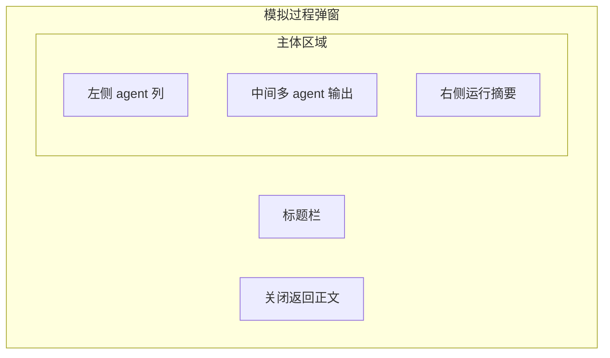

# PRD 03 模拟过程弹窗

## 页面目标

作为挂在写作工作台上的 `SimulationRun` 观察弹窗，负责展示多 agent 输出、状态摘要和关键裁决，帮助作者理解这轮模拟为什么生成成当前结果。

## 用户任务

- 查看当前模拟中的多 agent 输出
- 理解不同 agent 各自做了什么判断
- 查看当前运行摘要
- 关闭弹窗并回到写作工作台继续修改正文

## 核心功能

- 工作台上的模态弹窗展示
- 多 agent 列表
- 发言 / 意图 / 裁决三类输出卡片
- 运行摘要
- 关闭返回正文

## 页面区域划分

- 模态标题栏：当前弹窗标题与运行说明
- 左侧 agent 列区
- 中间输出主视图区
- 右侧摘要区
- 底部关闭区

## 关键交互

- 仅当存在 `SimulationRun` 时才允许打开弹窗
- 左侧按 agent 切换：导演 Agent、叙述 Agent、状态机 Agent
- 中间主视图区按 agent 展示输出结果卡片
- 运行中阶段采用”按阶段整批刷新”，不以 token 流式逐字更新中间卡片
- 运行中阶段刷新时，必须稳定显示”已完成 / 进行中 / 待开始”的分段刷新状态，避免半成品文本抖动
- 右侧摘要区展示当前运行状态与活跃 agent 数
- 作者可直接编辑当前阶段的 prompt 文本，修改后即时生效
- 导演 Agent 反馈应用后，弹窗内必须展示反馈已被采纳的明确标识
- 点击”关闭”：回到写作工作台，不改变正文状态

## 状态与数据依赖

依赖类型：

- `SimulationRun`
- `InteractionLog`
- `WorldStateSnapshot`
- `Scene`

依赖接口：

- `ChapterGenerationOrchestrator`
- `SceneRoleplayRuntime`
- `SceneStateResolver`

页面状态：

- `hidden`
- `empty`
- `ready`
- `running`
- `error`

## 异常与空状态

- 当前章节没有运行过模拟：进入“空弹窗”状态，明确提示先发起 `SimulationRun`
- 某 agent 无输出：该 agent 仍出现在左侧，但中间显示空状态说明
- 模拟仍在运行：右侧摘要区显示“运行中”
- 模拟运行失败：进入失败态，明确显示失败 agent、错误摘要，以及“正文未被改写”的结果说明
- 模拟完成后：允许从工作台轻摘要条再次进入本轮多 agent 输出弹窗
- 阶段刷新中断：进入阶段刷新状态，已完成的阶段保持稳定，当前阶段展示刷新中标识，未开始阶段显示待开始
- 导演反馈应用成功：弹窗内展示反馈已被采纳的明确标识，相关输出卡片更新
- Prompt 编辑态：作者可直接在弹窗内编辑当前阶段 prompt，编辑后即时生效

## 验收标准

- 模态弹窗不再作为独立页面使用
- 作者能看清不同 agent 的职责与输出差异
- 作者在 `5` 秒内必须能区分发言、意图与裁决三类信息
- 没有运行过模拟时，不会出现“空壳监视器页”，而是给出明确的引导弹窗
- 空弹窗需要明确提示先发起 `SimulationRun`
- 模拟失败时，必须明确说明失败不会改写正文，也不会写入章节版本
- 模拟完成或失败后，工作台都必须保留一个轻摘要回传入口，方便作者重新查看本轮结果
- 运行中阶段必须稳定显示“已完成 / 进行中 / 待开始”的分段刷新状态，避免半成品文本抖动
- 监视器不得做成终端风或纯日志墙，主视图区应保留结构化卡片层级
- 右侧摘要区与状态快照区必须保持次级视觉权重，不能抢占中间输出主区注意力
- 关闭弹窗后，回到原工作台位置
- Prompt 编辑必须在弹窗内完成，不跳出独立编辑页
- 导演反馈应用后，必须在弹窗内给出可感知的反馈标识
- 阶段刷新中断时，已完成的阶段内容必须保持稳定不丢失

## UI 设计标准约束

本页面必须遵守以下已固定的 UI 设计基线（来源：`ui-design-standards.md`）：

**页面级规则（§9.2）**：必须视觉区分三类信息（发言、意图、裁决）；不得做成终端风或日志墙；状态快照区要安静，不抢日志主区注意力。

**组件与造型（§5）**：输出卡片使用 12px 圆角；主视图区靠边框与明度分层，不靠厚重阴影。

**组件状态（§6）**：Agent 列表遵循 List/Row 统一状态（default / hover / selected / disabled）；selected 只使用一层柔和底色 + 左侧高亮条；hover 与 selected 必须可并存且可区分。

**色彩（§3）**：发言、意图、裁决三类信息必须通过独立的视觉层级区分（底色、边框或图标），不允许只依赖文字标签；日志列表优先保证垂直对齐和行距一致。

## 视觉规范参考

本页面遵循 [UI 设计稿标准](/Users/chengwen/dev/novel-wirter/docs/mvp/ui-design-standards.md) 中的以下固定规则：

- **视觉区分**：必须视觉区分发言、意图、裁决三类信息，不得做成终端风或日志墙
- **状态快照区**：保持次级视觉权重，不能抢占中间输出主区注意力
- **色彩主题**：`Warm Linen`
- **组件造型**：`Basic Roundness`
- **列表状态**：selected 使用柔和底色 + 左侧高亮条
- **动效策略**：`适度叙事型`，模拟运行状态推进允许适度动效

## 低保真线框布局

