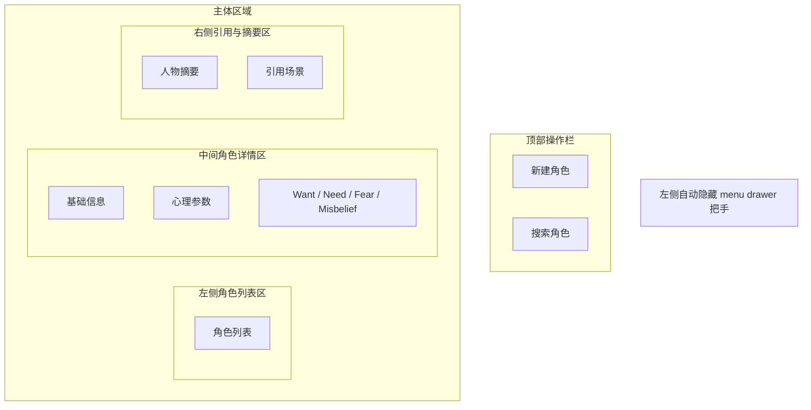

# PRD 04 角色库页

## 页面目标

用于创建、编辑、查找和复用 `Character`，为场景模拟提供稳定的人物资料来源。

## 用户任务

- 创建新角色
- 编辑人物信息与心理参数
- 查看角色被哪些场景引用
- 归档不再使用的角色

## 核心功能

- 左侧自动隐藏的全局 `menu drawer` 把手
- 角色列表与搜索
- 角色详情编辑表单
- 心理参数编辑
- Want / Need / Fear / Misbelief 编辑
- 场景引用摘要

## 页面区域划分

- 左侧全局壳层：自动隐藏 `menu drawer` 把手
- 左侧角色列表区
- 中间角色详情区
- 右侧引用与摘要区
- 顶部操作栏

## 关键交互

- 点击角色名：加载该角色详情
- 点击“新建角色”：创建空白角色并自动聚焦名称
- 修改关键字段后自动保存
- 角色卡保存成功后，工作台相关人物摘要应立即刷新
- 点击“查看引用场景”：跳转写作工作台并定位场景

## 状态与数据依赖

依赖类型：

- `Character`
- `Chapter`
- `Scene`

页面状态：

- `loading`
- `empty`
- `ready`
- `running`
- `error`

## 异常与空状态

- 当前项目无角色：进入空状态，展示“创建第一个角色”
- 搜索无结果：保留搜索关键词，左侧列表进入“无匹配角色”状态，中间与右侧改为结果说明与改搜建议
- 删除被引用角色：进入引用确认状态，提示先查看引用场景再删除
- 填写不完整：进入必填缺失状态，高亮未填必填字段，并明确提示当前不会写入角色索引

## 验收标准

- 当前项目无角色时，不显示空白详情页，而是展示明确创建入口
- 搜索无结果时，不显示旧角色详情，而是展示明确的无结果说明与清空搜索入口
- 必填字段缺失时，必须高亮缺失字段，并明确说明当前人物摘要与引用索引暂不可用
- 新建角色后可立即在写作工作台被选择
- 角色详情修改后，回到工作台能看到最新摘要
- 删除被引用角色后，相关工作台场景必须出现“角色引用已失效”提示，直到重新绑定角色
- 引用场景跳转成功，且不会丢失当前未保存角色改动
- 删除被引用角色时，必须先经过确认提示，不允许直接删除

## 低保真线框布局

