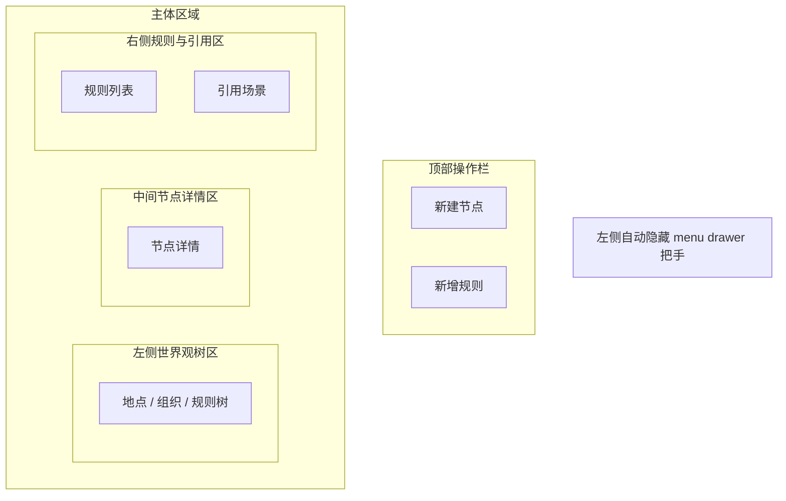

# PRD 05 世界观页

## 页面目标

用于管理 `WorldNode` 与 `RuleConstraint`，为写作工作台和状态机提供地点、组织、规则和限制条件。

## 用户任务

- 创建地点、组织、设定规则
- 维护父子层级
- 查看某条规则影响哪些场景
- 为场景设置地点与限制条件

## 核心功能

- 左侧自动隐藏的全局 `menu drawer` 把手
- 世界观树形结构
- 节点详情编辑
- 规则编辑
- 场景引用摘要

## 页面区域划分

- 左侧全局壳层：自动隐藏 `menu drawer` 把手
- 左侧世界观树区
- 中间节点详情区
- 右侧规则与引用区
- 顶部操作栏

## 关键交互

- 点击树节点：加载详情
- 新建子节点：自动继承父层级
- 新增规则：绑定到当前节点
- 世界观节点保存成功后，工作台相关地点 / 规则摘要应立即刷新
- 点击引用场景：跳转写作工作台

## 状态与数据依赖

依赖类型：

- `WorldNode`
- `RuleConstraint`
- `Scene`

页面状态：

- `loading`
- `empty`
- `ready`
- `running`
- `error`

## 异常与空状态

- 当前项目没有世界观节点：进入空状态，提示先创建地点、组织或关键物件
- 筛选无结果：保留当前筛选词，左侧树区进入“无匹配节点”状态，中间与右侧改为结果说明与改筛建议
- 节点缺少类型时：进入缺少类型状态，高亮类型字段，并明确提示当前不会写入世界观索引
- 删除含子节点的父节点时进入确认状态，明确提示会影响子节点和规则摘要

## 验收标准

- 当前项目无世界观节点时，不显示空白详情区，而是展示明确创建入口
- 筛选无结果时，不显示旧节点详情，而是展示明确的无结果说明与清空筛选入口
- 节点缺少类型时，必须高亮类型字段，并明确说明当前规则摘要与引用索引暂不可用
- 世界观层级关系保存后，重新进入页面仍保持树形结构
- 规则变更后，写作工作台的地点摘要能同步更新
- 删除被引用世界观节点后，相关工作台场景必须出现“世界观引用已失效”提示，直到重新绑定地点或规则
- 跳转回写作工作台后能定位到引用该节点的场景
- 删除含子节点父节点时，必须先经过确认提示

## 低保真线框布局

