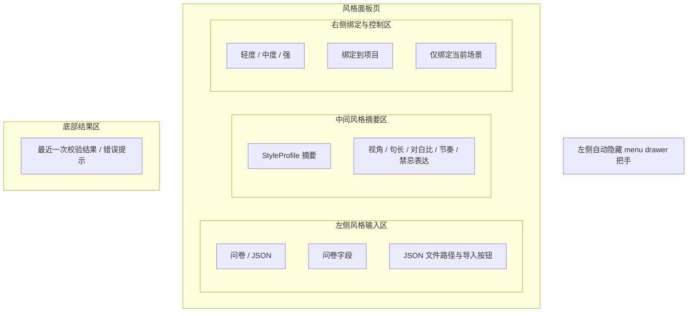

# PRD 06 风格面板页

## 页面目标

用于通过风格问卷或 `StyleProfile JSON` 创建 `StyleProfile`、调整风格强度，并把风格绑定到项目或场景。

## 用户任务

- 填写风格问卷
- 导入 `StyleProfile JSON`
- 预览风格摘要
- 选择轻度、中度、强三档强度
- 绑定到项目或当前场景

## 核心功能

- 左侧自动隐藏 `menu drawer` 把手
- 问卷 / JSON 双模式输入
- 风格摘要预览
- 强度切换
- 项目级绑定
- 场景级覆盖绑定

## 页面区域划分

- 左侧全局壳层：自动隐藏 `menu drawer` 把手
- 左侧风格输入区：问卷 / JSON 双模式
- 中间风格摘要区
- 右侧绑定与控制区
- 底部结果区

## 关键交互

- 左侧输入区使用 `问卷 / JSON` 双 tab
- 问卷模式下，作者填写名称、体裁、视角、对白比例等字段
- JSON 模式下，作者选择本地 `StyleProfile JSON` 文件
- 问卷提交或 JSON 校验成功后立即展示风格摘要
- 中间摘要区始终以“已定风格卡”的方式展示结果，不切换为代码检查器式主视图
- 切换强度后，写作工作台的输出约束实时更新
- 点击”绑定到项目”：作为默认风格，绑定成功后中间摘要区展示”已绑定为项目默认”标识
- 点击”仅绑定当前场景”：覆盖项目级风格，绑定成功后展示场景级覆盖提示

## 状态与数据依赖

依赖类型：

- `StyleProfile`
- `StyleProfileJson`
- `NovelProject`
- `Scene`

依赖接口：

- `AppWorkspaceStore` style normalization

相关规格文档：

- [风格问卷规格说明](/Users/chengwen/dev/novel-wirter/docs/mvp/style-questionnaire-spec.md)

页面状态：

- `loading`
- `empty`
- `ready`
- `running`
- `success`
- `error`

## JSON 格式约定

`StyleProfile JSON` 使用固定字段集合，MVP 只识别以下字段：

必填字段：

- `version`
- `name`
- `language`
- `genre_tags`
- `pov_mode`
- `dialogue_ratio`
- `description_density`
- `emotional_intensity`
- `rhythm_profile`
- `taboo_patterns`

可选字段：

- `sentence_length_preference`
- `tone_keywords`
- `narrative_distance`
- `notes`

建议示例：

```json
{
  "version": "1.0",
  "name": "冷峻悬疑第一人称",
  "language": "zh-CN",
  "genre_tags": ["悬疑", "现实"],
  "pov_mode": "first_person_limited",
  "dialogue_ratio": "medium",
  "description_density": "low",
  "emotional_intensity": "medium_high",
  "rhythm_profile": "tight",
  "taboo_patterns": ["过度抒情", "全知解释"],
  "sentence_length_preference": "short_medium",
  "tone_keywords": ["冷静", "压迫", "克制"],
  "narrative_distance": "close"
}
```

字段规则：

- `version` 仅支持 `1.0`
- `language` 在 MVP 中默认使用 `zh-CN`
- `genre_tags` 最少 1 项，最多 5 项
- 枚举字段出现未知值时视为校验失败
- 额外未知字段允许存在，但会被忽略并提示

## 异常与空状态

- 尚未填写问卷或导入 JSON：进入空状态，展示“填写问卷 / 导入 JSON”双入口
- JSON 格式非法：进入 JSON 校验失败状态，明确展示字段错误原因
- 问卷缺少必填项：进入缺少必填项状态，禁止生成 `StyleProfile`，并高亮缺失字段
- 风格校验失败：进入校验失败状态，不生成 `StyleProfile`，并保留当前风格输入供用户调整后重试
- JSON `version` 不受支持：进入版本不兼容阻断态，阻止导入，并提示重新导出 `version: 1.0` 配置
- JSON 存在未知字段：进入轻提示状态，继续生成 `StyleProfile`，并明确展示哪些字段已被忽略
- 同一项目已保留 3 个风格配置：进入上限状态，要求先删除或替换现有配置
- 场景级绑定与项目级绑定冲突时，以场景级优先并明确提示
- JSON 模式激活：切换到 JSON tab 后，输入区展示文件选择与导入按钮，摘要区保持"已定风格卡"式展示
- 项目默认绑定成功：绑定成功后，中间摘要区必须展示"已绑定为项目默认"标识，不能只做静默绑定

## 验收标准

- 未创建风格配置时，中间摘要区应展示明确空状态，而不是空白页面
- 问卷入口与 JSON 导入入口必须保持同级，不得把其中一项折叠为次级入口
- 问卷提交成功后，能在 3 秒内看到风格摘要
- 导入合法 JSON 后，能在 3 秒内看到风格摘要
- 导入非法 JSON 后，能看到明确的错误项与“重新选择 JSON”入口
- 问卷缺少必填项时，左侧必须高亮缺失字段，中间摘要区必须明确说明“未生成”
- 风格校验失败时，中间摘要区必须切换为失败说明，同时保留左侧已填写输入
- JSON `version` 不受支持时，必须进入独立阻断态，且不能退化成普通 JSON 校验错误
- JSON 存在未知字段时，必须继续生成 StyleProfile，但要给出明确的忽略提示
- 达到 3 个风格配置上限时，不允许继续新增，并需要展示替换或管理现有配置的入口
- 强度切换后，不需要重开页面即可生效
- 项目级与场景级绑定关系清晰可见
- JSON 模式切换后，输入区必须展示文件选择与导入按钮，摘要区不得退化为代码检查器式视图
- 项目默认绑定成功后，中间摘要区必须展示可感知的绑定标识，不能只做静默绑定
- 场景级覆盖绑定时，必须同时展示项目默认与场景覆盖的层级关系
- 中间摘要区必须表现为“已定风格卡”，不能退化成只显示字段校验结果的检查器面板
- 问卷字段分组必须有清晰的引导顺序与层级，避免平铺成无分组长表单
- JSON 缺少必填字段时不会生成 `StyleProfile`
- JSON 存在未知字段时不会报错，但会给出忽略提示
- 同一项目最多保留 3 个风格配置，超出时阻止新增

## UI 设计标准约束

本页面必须遵守以下已固定的 UI 设计基线（来源：`ui-design-standards.md`）：

**页面级规则（§9.3）**：问卷入口与 JSON 导入入口必须同级出现；中间摘要区像"已定风格卡"，不是代码检查器；问卷分组必须强引导、强层级。

**组件状态（§6）**：表单字段遵循 Input 统一状态（default / focused / filled / error / disabled）；focused 必须同时体现边框变化和背景/阴影微变化；error 态必须带说明文本，不能只靠红边框。

**色彩（§3）**：中间风格摘要卡使用 `bg.surface` 底色 + `border.default` 边框；校验失败使用 `accent.danger`；忽略提示使用 `accent.warning`。

**布局（§2）**：页面外边距 24px；区块间距 16px；卡片内部内边距 16px。

## 低保真线框布局


