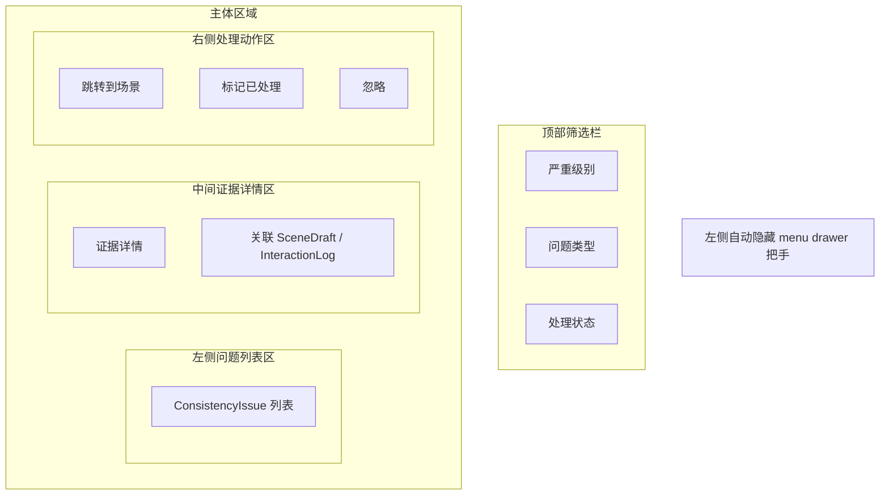

# PRD 07 审计中心页

## 页面目标

集中展示一致性问题、证据与处理状态，帮助作者判断当前草稿是否存在角色、规则、道具和时间线冲突。

## 用户任务

- 查看当前项目的审计问题
- 按问题类型筛选
- 跳转到对应场景修复
- 标记问题为已处理或忽略

## 核心功能

- 左侧自动隐藏的全局 `menu drawer` 把手
- 问题列表
- 证据查看
- 分类筛选
- 跳转修复入口
- 处理状态更新

## 页面区域划分

- 左侧全局壳层：自动隐藏 `menu drawer` 把手
- 左侧问题列表区
- 中间证据详情区
- 右侧处理动作区
- 顶部筛选栏

## 关键交互

- 点击问题项：加载证据和建议修复
- 点击“跳转到场景”：回到写作工作台对应位置
- 点击“标记已处理”：更新处理状态
- 点击“忽略”：要求填写忽略原因

## 状态与数据依赖

依赖类型：

- `ConsistencyIssue`
- `Scene`
- `SceneDraft`
- `InteractionLog`

页面状态：

- `loading`
- `empty`
- `ready`
- `running`
- `error`

## 异常与空状态

- 当前项目没有审计问题：展示“暂无冲突”
- 筛选无结果：保留当前筛选条件，左侧列表进入“无匹配问题”状态，中间与右侧改为结果说明与改筛建议
- 证据关联草稿已被删除：进入“关联草稿缺失”状态，保留问题条目，证据区提示无法定位并提供返回工作台 / 重新审计入口
- 跳转场景失败：进入跳转失败状态，明确说明目标场景不存在，并提供返回工作台 / 重新审计入口

## 验收标准

- 问题按严重级别和最近更新时间排序
- 筛选无结果时，不显示旧证据详情，而是展示明确的无结果说明与清空筛选入口
- 证据关联草稿已缺失时，必须保留问题条目，并明确说明当前无法跳转到原证据位置
- 跳转场景失败时，必须明确说明目标场景不存在，且不能继续执行“跳转到场景”
- 跳转到场景后，作者能直接看到对应文本或回合证据
- 标记已处理后，问题状态立即刷新

## 低保真线框布局

