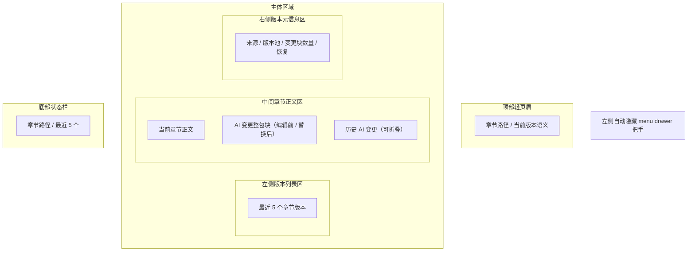

# PRD 08 章节版本页

## 页面目标

展示章节当前正文与最近 `5` 个版本的演进，支持恢复版本，并清楚呈现整次 AI 接受变更的来源与范围。

## 用户任务

- 查看当前章节的最近 5 个版本
- 查看本次 AI 整包变更
- 恢复某个历史版本
- 查看版本来源

## 核心功能

- 左侧自动隐藏的全局 `menu drawer` 把手（18-20px 宽，展开态 220-240px）
- 顶部轻页眉：章节路径 / 当前版本语义
- 最近 5 个版本列表
- 当前章节正文
- AI 变更块展示：`编辑前 / 替换后`
- 历史 AI 变更折叠
- 版本元信息
- 恢复版本

## 页面区域划分

- 左侧全局壳层：自动隐藏 `menu drawer` 把手（18-20px 宽）
- 顶部轻页眉：章节路径 / 当前版本语义
- 左侧版本列表区
- 中间章节正文区
- 右侧版本元信息区
- 底部状态栏（28-30px 高）

## 关键交互

- 页面沿用非阅读页的统一壳层与列表 / 详情节奏，不单独发明新壳层
- 不再区分“草稿”和“版本”，只有当前章节正文与最近 5 个版本
- 系统只保留最近 5 个版本，新版本只有在落盘成功后才自动淘汰最旧版本
- 点击版本：加载对应章节版本
- AI 结果只有在作者点击“接受变更”后才生成一个新版本
- 一整次 AI 接受变更只算 `1` 个版本
- 即使在确认弹窗中排除部分变更块，本次提交仍只生成 `1` 个版本
- 点击“恢复此版本”：不会覆写原历史记录，而是创建一个新的当前版本，并将被恢复的历史版本保留在列表中
- 当前版本中的 AI 变更块需要展示：
  - 编辑前内容
  - 替换后内容
- 历史版本中的 AI 变更默认允许折叠 / 展开
- 历史 AI 变更的展开 / 折叠状态按版本记忆：切换到其他版本再返回时，恢复该版本上次的查看状态

## 状态与数据依赖

依赖类型：

- `Chapter`

页面状态：

- `loading`
- `empty`
- `ready`
- `running`
- `error`

## 异常与空状态

- 当前章节只有 1 个版本：进入单版本状态，可查看但不可恢复历史内容
- 版本池已满：进入“最旧版本待淘汰”提示状态，明确说明下一次接受变更会自动挤出最旧版本
- 当版本池已满且新版本尚未落盘时：进入“等待落盘再淘汰”状态，明确说明失败时不会剔除最旧版本
- 恢复失败：进入恢复失败状态，保留原有正文与版本池，并提示失败原因与重试入口
- 恢复成功：进入恢复成功状态，新当前版本插入列表顶部；若版本池已满，则自动剔除最旧版本
- 历史版本包含 AI 变更：允许折叠 / 展开该次 AI 编辑内容

## 验收标准

- 版本页沿用统一应用壳层：左侧隐藏 handle、顶部轻页眉、主体三栏、底部状态栏
- 页面始终只展示最近 5 个版本
- 新版本落盘成功后，最旧版本会被自动移出版本池
- 当版本池已满时，左侧列表和右侧元信息都必须明确指出哪一个版本会在下一次写入时被淘汰
- 当新版本落盘失败时，版本池必须保持原样，不能提前剔除最旧版本
- 恢复成功后，必须新增一个来源为“恢复版本”的当前版本，而不是直接改写原历史版本
- 恢复失败时，当前正文与版本池都必须保持不变，并提供返回当前正文与重试恢复的动作
- 当前只有 1 个版本时，右侧元信息与主操作要同步切换到“不可恢复”语义
- 当前只有 1 个版本时，左侧版本列表仅显示当前版本，不展示虚假的历史列表
- 当前版本能显示“AI 接受变更”来源
- AI 变更显示为整包块，而不是碎片化的多次记录
- 当前版本里的 AI 变更块能同时看到“编辑前 / 替换后”
- 历史 AI 变更允许折叠
- 历史 AI 变更切换版本后，必须按版本恢复上次的展开 / 折叠状态
- 恢复旧版本后，不会破坏版本池策略

## UI 设计标准约束

本页面必须遵守以下已固定的 UI 设计基线（来源：`ui-design-standards.md`）：

**页面级规则（§9.4）**：版本历史页共用项目列表、角色库、世界观页等同一套壳层；同样的顶部结构、同样的卡片和列表规则、同样的筛选区与详情区节奏；不允许重新发明一套视觉语言。

**组件状态（§6）**：版本列表遵循 List/Row 统一状态（default / hover / selected / disabled）；selected 只使用一层柔和底色 + 左侧高亮条；hover 与 selected 必须可并存且可区分。

**造型（§5）**：AI 变更块使用 12px 圆角卡片；普通卡片无阴影或极弱阴影；当前版本中的 AI 变更块使用 `border.strong` 边框区分。

**布局（§2）**：左侧 menu handle 18-20px，展开态 220-240px；底部状态栏 28-30px 高；紧凑列表行高 36-40px。

## 低保真线框布局

