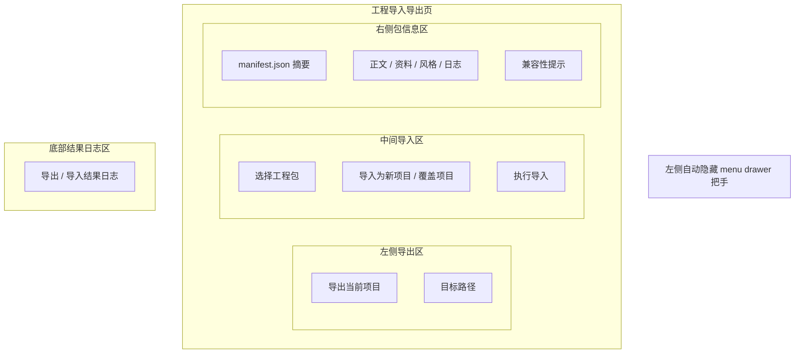

# PRD 09 工程导入导出页

## 页面目标

负责将本地隐藏数据库中的工程导出为 `ProjectExportPackage`，以及把工程包重新导入客户端。

## 用户任务

- 导出当前项目
- 检查导出包内容
- 导入外部工程包
- 选择导入为新项目或覆盖项目

## 核心功能

- 左侧自动隐藏的全局 `menu drawer` 把手
- 导出工程
- 导入工程
- 显示 `manifest.json` 摘要
- 版本兼容提示
- 覆盖导入确认
- 错误包拦截弹窗

## 页面区域划分

- 左侧全局壳层：自动隐藏 `menu drawer` 把手
- 左侧导出区
- 中间导入区
- 右侧包信息区
- 底部结果日志区

## 关键交互

- 点击“导出当前项目”：触发 `ProjectTransferService`
- 点击“选择工程包”：读取本地包文件
- 导入前展示包版本、项目名、内容摘要
- 导入时默认选“导入为新项目”
- 只有当包内项目 ID 与本地项目 ID 相同，才显示“覆盖项目”选项
- 选择“覆盖项目”后，必须先经过覆盖导入确认弹窗
- 覆盖导入成功后，进入覆盖成功摘要态，并明确说明旧索引已被替换刷新
- 当包缺少 `manifest.json` 或 `schema_major` 不一致时，弹出错误包拦截弹窗，并阻止导入
- 导入成功后，进入成功摘要态，并提供“打开项目”与“返回项目列表”两个后续动作
- 导入成功后，必须同步刷新角色、世界观、风格、版本与最近写作位置索引

## 状态与数据依赖

依赖类型：

- `NovelProject`
- `ProjectExportPackage`

依赖接口：

- `ProjectTransferService`

页面状态：

- `loading`
- `empty`
- `ready`
- `running`
- `success`
- `error`

## 异常与空状态

- 当前没有可导出项目：进入“无可导出项目”状态，左侧导出区禁用，并提示先创建或导入项目
- 包内缺少 `manifest.json`：进入缺少清单文件阻断态，禁止导入，并明确说明无法读取项目元信息
- `schema_major` 不一致：进入“版本主号不兼容”阻止态，禁用导入按钮，并提示重新导出或升级客户端
- `schema_minor` 不一致：允许导入，但弹出兼容性警告
- 覆盖导入：必须二次确认

## 验收标准

- 成功导出后，右侧包信息区可看到导出内容摘要
- 导入为新项目后，项目列表页新增一条记录
- 导入成功后，必须明确展示索引刷新完成，且允许直接打开新导入项目
- 无可导出项目时，中间区域必须展示明确引导，不允许只留下空白导出表单
- 包内缺少 `manifest.json` 时，必须进入专用阻断态，不能退化成普通导入失败提示
- 覆盖导入不会静默覆盖，必须出现确认提示
- 覆盖导入成功后，角色 / 世界观 / 风格 / 版本 / 最近写作位置索引必须全部以新导入内容替换
- 错误包不会污染本地数据库
- `schema_major` 不一致时，必须进入明确的阻止态，不允许继续触发导入
- 非法工程包必须进入错误拦截态，而不是继续停留在普通导入表单

## 低保真线框布局

