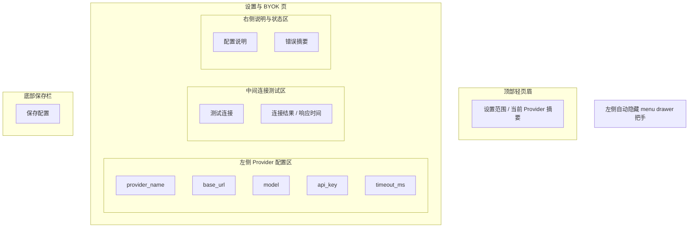

# PRD 10 设置与 BYOK 页

## 页面目标

负责配置 `LlmProviderConfig`、管理 BYOK 连接、执行连接测试，并控制客户端级通用设置。

## 用户任务

- 填写或修改 `base_url`
- 填写或修改 `model`
- 填写或修改 `api_key`
- 测试连接
- 查看错误信息

## 核心功能

- 顶部轻页眉：当前设置范围与 Provider 摘要
- OpenAI-compatible 配置表单
- API Key 掩码展示
- 连接测试
- 超时时间配置
- 通用偏好设置

## 页面区域划分

- 左侧全局壳层：自动隐藏 `menu drawer` 把手（18-20px 宽，展开态 220-240px）
- 顶部轻页眉：当前设置范围与 Provider 摘要
- 左侧 Provider 配置区
- 中间连接测试区
- 右侧说明与状态区
- 底部保存栏

## 关键交互

- 编辑表单字段后点击“保存配置”
- 保存成功后进入明确的“保存成功”反馈状态，并说明新配置从下一次 AI 请求开始生效
- 保存成功后，新的 `LlmProviderConfig` 从下一次 AI 请求开始生效
- 已经在途或已经失败的请求不会自动重试，作者需要手动再次发起
- 点击“测试连接”：发送最小化请求
- 测试成功时显示可用模型名与响应时间
- 测试失败时显示原始错误摘要
- API Key 字段默认掩码展示

## 状态与数据依赖

依赖类型：

- `LlmProviderConfig`

依赖接口：

- `LlmProviderAdapter`

页面状态：

- `loading`
- `ready`
- `running`
- `success`
- `error`

## 异常与空状态

- 尚未填写连接信息：进入未配置状态，禁用“测试连接”
- 未填写 `api_key`：禁止测试连接
- 保存成功：进入保存成功状态，展示明确成功反馈，并保留继续测试连接或返回工作的后续动作
- 已填写 `base_url` 与 `model` 但缺少 `api_key`：进入缺少 API Key 状态，明确提示先补全密钥
- `base_url` 非法：进入接口地址无效状态，明确提示 URL 格式错误并返回修改
- 模型不在允许列表中：进入模型不受支持状态，禁用测试连接与保存配置，并提示改用受支持模型
- 模型名为空：进入缺少模型状态，禁用测试连接与保存配置，并提示先填写 model
- 连接超时：进入连接测试失败状态，提供“关闭”与“重新测试”按钮
- `401 / 403`：进入鉴权失败状态，提示检查 API Key、组织权限或账号状态
- `404 / model_not_found`：进入模型不存在状态，提示检查模型名拼写或改用可用模型
- `DNS / 网络错误`：进入网络连接失败状态，提示检查网络环境、代理或接口可达性
- 配置文件读取失败：进入读取错误状态，提示配置文件可能损坏，并提供重试入口
- 配置文件写入失败：进入写入错误状态，提示保存失败，并提供重试入口
- 配置读取重试成功：读取失败后自动重试成功，页面恢复就绪态
- 配置写入重试成功：写入失败后重试成功，进入保存成功状态
- 连接测试超时：进入独立的超时状态，与普通连接失败区分，提供"关闭"与"重新测试"按钮
- 全局壳层配置告警：当全局配置文件读取或写入失败时，壳层顶部展示配置告警条，不阻断其他页面使用

## 验收标准

- 设置页沿用其他非阅读页的一致壳层与顶部结构，不单独发明一套视觉语言
- 保存后的配置在客户端重启后仍可读取
- API Key 不出现在导出包中
- 未配置连接时，页面应明确提示必须先填写 `api_key / base_url / 模型`
- 当 `base_url` 与 `model` 已填写但 `api_key` 缺失时，页面应进入专门的缺少 API Key 状态
- `base_url` 非法时，必须阻止保存并展示专门错误状态
- 模型不受支持时，必须阻止测试连接与保存配置，并明确给出建议模型
- 模型名为空时，必须高亮 model 字段，并同步禁用测试与保存
- 保存成功后，必须出现可感知的成功反馈，不能只做静默保存
- 保存成功后，下一次 AI 请求必须读取新配置，且不得自动重试旧请求
- 测试连接失败不会影响现有项目数据
- 连接测试失败时，必须明确展示失败状态与可重试动作
- `401 / 403`、`404 / model_not_found`、`DNS / 网络错误` 必须映射到不同错误状态，不能只用同一张泛化失败页
- 连接测试超时必须作为独立状态展示，不能与普通连接失败混淆
- 切换模型后，写作工作台下一次模拟立即使用新配置
- 配置文件读取失败时，必须提供重试入口，不能只展示静态错误
- 配置文件写入失败时，必须提供重试入口，不能丢失已填写的表单内容
- 配置读取重试成功后，页面必须无缝恢复就绪态
- 配置写入重试成功后，必须进入与首次保存成功一致的成功反馈状态
- 全局壳层配置告警不得阻断其他页面的正常使用

## UI 设计标准约束

本页面必须遵守以下已固定的 UI 设计基线（来源：`ui-design-standards.md`）：

**页面级规则（§9.4）**：设置页共用项目列表、角色库、世界观页等同一套壳层；同样的顶部结构、同样的卡片和列表规则；不允许重新发明一套视觉语言。

**组件状态（§6）**：表单字段遵循 Input 统一状态（default / focused / filled / error / disabled）；focused 必须同时体现边框变化和背景/阴影微变化；error 态必须带说明文本，不能只靠红边框；"保存配置"使用 `Primary` 按钮，"测试连接"使用 `Secondary` 按钮；同一区域最多一个 `Primary` 按钮。

**色彩（§3）**：连接成功使用 `success` 色调；连接失败按错误类型映射到 `accent.danger`、`accent.warning`、`accent.info`；API Key 掩码展示使用 `text.tertiary` 色调。

**图像（§8）**：设置与 BYOK 页不使用 Candid Lifestyle Photography；全部以结构、排版、层次为主。

## 视觉规范参考

本页面遵循 [UI 设计稿标准](/Users/chengwen/dev/novel-wirter/docs/mvp/ui-design-standards.md) 中的以下固定规则：

- **共享壳层**：与项目列表、角色库等共用同一套壳层（左侧隐藏 handle、顶部轻页眉、底部状态栏）
- **表单规范**：输入类组件统一状态（default / focused / filled / error / disabled），error 态必须带说明文本
- **禁止摄影图像**：设置页不使用 `Candid Lifestyle Photography`
- **色彩主题**：`Warm Linen`
- **组件造型**：`Basic Roundness`

## 低保真线框布局

