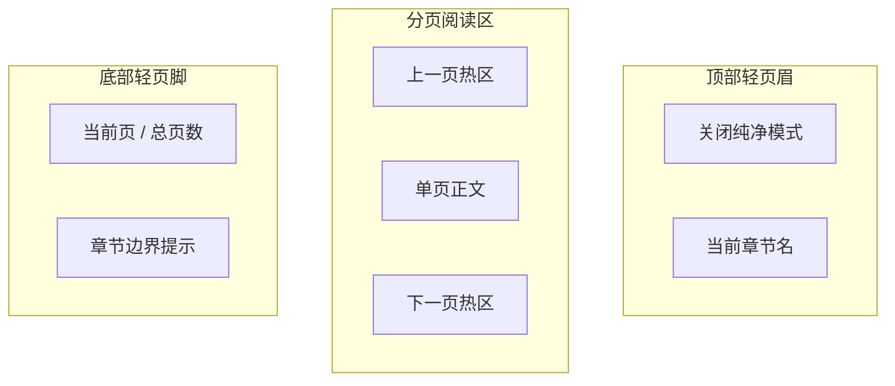

# PRD 11 纯净阅读态

## 页面目标

作为从写作工作台进入的独立阅读器视图，负责让作者在低干扰环境中通读当前章节，并通过分页翻页继续阅读前后页面与相邻章节。

## 用户任务

- 进入纯净阅读
- 阅读当前章节的单页内容
- 通过左右翻页继续阅读
- 在章节边界切换上一章 / 下一章
- 关闭纯净阅读并回到进入前的位置

## 核心功能

- 独立顶层 frame
- 分页阅读
- 左右翻页热区
- 键盘方向键翻页
- 轻页眉：关闭纯净模式、当前章节名
- 轻页脚：当前页码、章节边界提示

## 页面区域划分

- 顶部轻页眉：关闭纯净模式、章节名
- 中部正文页：单页正文排版
- 左右翻页热区
- 底部轻页脚：页码与边界提示

## 关键交互

- 打开纯净阅读后，进入独立阅读 frame，而不是工作台内嵌态
- 打开纯净阅读时，系统必须记录 `return_anchor`：
  - 当前章节 / Scene
  - 当前编辑器滚动位置
  - 当前光标或选区锚点
- 左右热区和左右方向键都可翻页
- 同章节内部先翻页
- 本章最后一页后，进入下一章第一页
- 本章第一页前，进入上一章最后一页
- 关闭纯净阅读后，优先返回进入前的章节与编辑位置：
  - 先恢复章节 / Scene
  - 再恢复编辑器滚动位置
  - 最后恢复光标或选区锚点
- 如果原光标锚点因正文变化失效，则回退到最近可定位段落的起始位置
- 不显示版本入口、AI 工具、资料导航和高亮开关

## 状态与数据依赖

依赖类型：

- `Chapter`
- `Scene`

页面状态：

- `loading`
- `ready`
- `page_turning`
- `error`

## 异常与空状态

- 当前章节无法分页：显示单页阅读态，正文整章单页展示，并弱化左右翻页热区
- 上一章或下一章不存在：进入边界无效轻提示状态，并明确说明当前已到章节起点或终点；首章与终章都需要独立提示
- 当前为本章第一页时，进入章节起点提示状态，明确说明再向前一页会进入上一章最后一页
- 当前为本章最后一页时，进入章节边界提示状态，明确说明再翻一页会进入下一章

## 验收标准

- 纯净阅读作为独立顶层画布存在
- 页面保持纯阅读器定位，不混入编辑工具
- 当前章节无法分页时，必须进入单页阅读态，而不是展示空白分页器
- 页眉与页脚存在，但正文仍然是绝对主角
- 不存在上一章或下一章时，必须给出轻提示，而不是继续模拟有效翻页；首章和终章都应有独立边界态
- 翻到章节边界时，能正确切章
- 第一页需要明确提示“再向前一页进入上一章”
- 最后一页需要明确提示“再翻一页进入下一章”
- 关闭后，能按“章节 / 滚动位置 / 光标锚点”的顺序恢复进入前位置

## 低保真线框布局

