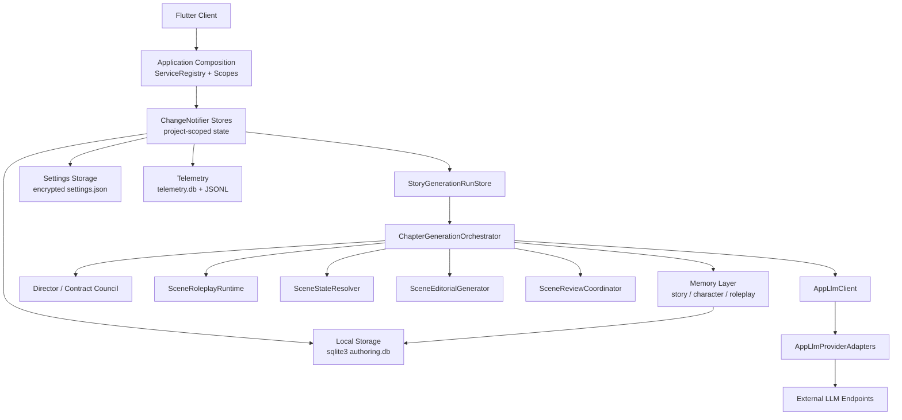
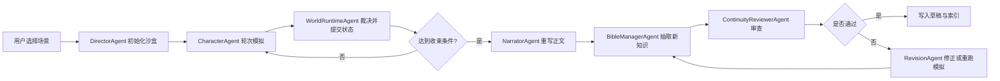

# 长篇小说辅助写作系统构建设计

## 1. 设计目标

本系统不是通用聊天式写作工具，而是面向中长篇、长篇、系列小说创作的结构化创作平台。它要解决的核心问题不是“生成一段文字”，而是“在持续数十万字的创作过程中，稳定维护人物、世界观、时间线和情节因果的一致性”。

系统目标如下：

- 支持从灵感、大纲、章节、场景到定稿的全流程写作。
- 支持本地优先的创作体验，弱网或离线时仍可查看资料、编辑工程与回溯历史。
- 通过结构化记忆系统降低角色漂移、设定冲突、时间线错乱和道具状态失真。
- 将 AI 从“单次文本生成器”升级为“可检索、可审计、可修正”的协作式创作助手。
- 为后续扩展到桌面端、平板端、移动端保持统一架构。

非目标：

- 不追求一次性生成整本高质量小说。
- 不将模型上下文窗口扩展视为唯一解法。
- 不把所有逻辑堆进单一提示词或单一 Agent。

## 2. 系统定位

建议将系统定位为一个 `Local-first + Cloud-optional` 的小说创作工作台：

- 本地负责编辑体验、项目管理、结构化数据缓存、轻量检索和状态展示。
- 云端或本机 AI 服务负责复杂推理、图谱抽取、GraphRAG、多智能体编排和一致性审计。
- 写作过程围绕“项目工程”展开，而不是围绕单次对话展开。

系统最终形态更像：

- Scrivener/Obsidian 式的工程化写作工具
- + 故事圣经与知识图谱管理器
- + AI 场景模拟与叙述重写工作台
- + 连贯性审计和修复引擎

## 3. 总体架构



架构拆分为六层：

1. Flutter 客户端层
2. 应用状态与依赖注入层
3. 本地持久化与设置加密层
4. AI 接入与模型适配层
5. 场景编排、角色模拟与审稿层
6. 结构化记忆与可观测性层

## 4. 客户端架构设计

## 4.1 Flutter 端职责

Flutter 客户端负责以下能力：

- 工程管理：小说项目、卷、章、场景、素材库
- 编辑器：富文本正文编辑、草稿版本切换、局部重写
- 角色与世界观面板：角色卡、关系网、地点树、规则库
- 时间线面板：事件流、章节顺序、冲突检测
- AI 交互面板：模拟、改写、续写、审查、修复建议
- 沙盒监视器：查看角色发言、动作提案、系统裁决和导演投放事件
- 角色认知面板：查看角色记忆、反思、计划和当前心理状态
- 作者介入控制台：允许作者以“上帝”或“角色”身份插入指令
- 图谱可视化：实体关系图、事件链路图
- 审计结果展示：冲突列表、风险提示、建议修复

推荐 UI 分区：

- 左侧：工程导航树
- 中部：正文编辑器
- 右侧：上下文助手与角色认知面板
- 底部：模拟日志、版本、AI 任务流、审计结果

## 4.2 状态管理实现

当前实现没有引入 Riverpod。应用使用一个轻量的手写组合根：

- `NovelWriterApp` 创建 `ServiceRegistry`，通过 `registerAppServices` 懒加载注册应用服务。
- UI 通过 `ServiceScope` 获取需要按需解析的服务。
- 常驻状态使用 `ChangeNotifier` store，并通过 `InheritedWidget` / `InheritedNotifier` scope 下发到页面。
- 项目相关 store 监听 `AppWorkspaceStore` 的当前项目变化，切换 project scope 后恢复各自的本地快照。

当前主要状态分层：

- `AppWorkspaceStore`：项目、场景、角色、世界观、风格、审计问题和当前工作区。
- `AppDraftStore`：项目草稿正文。
- `AppVersionStore`：项目版本历史。
- `AppSceneContextStore`：当前场景上下文快照。
- `StoryOutlineStore` / `StoryGenerationStore`：大纲和项目级生成状态。
- `StoryGenerationRunStore`：当前 scene-scope 的运行状态、阶段消息、失败/完成快照。
- `AppSettingsStore`：BYOK、provider profiles、模型路由、超时和主题。
- `AppEventLog`：应用事件和 LLM 调用可观测性。

## 4.3 本地数据层

当前本地持久化使用 `sqlite3` 直接 SQL，而不是 Drift ORM。schema 由本地 migration helper 管理，IO storage 类按 store 边界拆分。

选择这个实现的原因：

- 依赖少，符合当前 `pubspec.yaml` 的最小运行时依赖。
- 适合本地优先缓存。
- 能承载关系型结构化数据。
- 支持事务、索引、离线编辑和跨平台桌面运行。

本地数据库承担：

- 工程主数据缓存
- AI 任务日志缓存
- 模拟日志与世界状态快照缓存
- 最近检索包缓存
- 草稿与版本快照
- 本地搜索索引
- story generation run snapshot
- story / character / roleplay memory artifacts

设置数据不进入专门的系统 secure store；当前实现为 `settings.json` 加密文件，使用 AES-GCM envelope 和 `.settings.key`，并支持 `NOVEL_WRITER_SETTINGS_AES_KEY` 环境变量覆盖密钥来源。

## 5. AI 接入与本地编排层

## 5.1 当前实现边界

当前 MVP 没有强制后端服务层。编排、角色模拟、记忆落盘、审稿和导出都在 Flutter 客户端进程内完成；外部依赖只是在需要生成或审稿时调用用户配置的模型端点。

当前核心边界如下：

- `AppSettingsStore`
  - 负责 BYOK 配置、provider profile、trace-name 路由、并发池和连接测试。
- `AppLlmClient`
  - 提供 `chat` / `chatStream` 契约，IO 端用 `Dio` 调用外部模型端点。
- `AppLlmProviderAdapters`
  - 负责 OpenAI-compatible、Anthropic、Kimi、Mimo、Zhipu、Ollama 等请求格式和响应解析差异。
- `ChapterGenerationOrchestrator`
  - 负责任务编排、多 agent 调度、场景重规划、审稿和质量门。
- `SceneRoleplayRuntime`
  - 驱动角色轮次、发言顺序、公开事实提交和角色记忆提案。
- `SceneStateResolver`
  - 将角色回合与检索胶囊解析为可用于正文生成的 scene beats 和 scene state。
- `SceneEditorialGenerator` / `ScenePolishPass`
  - 将角色扮演过程、裁定事实和检索上下文重写为场景正文。
- `StoryMemoryStorage` / `CharacterMemoryStore` / `RoleplaySessionStore`
  - 负责故事记忆、角色记忆与 roleplay 工件的本地持久化。

可选演进方向：

- 如果需要团队协作、远端同步或集中式任务队列，可以再引入 API gateway / sync service。
- 如果需要跨项目大规模检索，可以再引入向量索引或图数据库。
- 如果需要长时间后台生成，可以把 `ChapterGenerationOrchestrator` 的契约外移到服务端 worker。

这些扩展目前不属于本地 MVP 的必要运行条件。

## 5.2 模型通信与可观测性

当前模型通信通过 `AppLlmClient` 发起 HTTP chat completion 请求。IO 实现优先尝试流式响应体解析，必要时回退到非流式解析；状态进度通过 `StoryGenerationRunStore` 的阶段消息和 `AppEventLog` 写入本地，而不是依赖客户端与后端之间的 SSE 任务流。

一次请求的关键数据包括：

- provider / model / base URL / timeout
- trace name 与 trace metadata
- prompt / completion token 统计（如果 provider 返回）
- latency、failure kind、错误详情
- event log correlation 信息

本地事件形态示例：

```json
{
  "eventId": "evt-123",
  "category": "ai",
  "action": "llm.chat",
  "status": "succeeded",
  "sessionId": "session-1",
  "correlationId": "corr-1",
  "payload": {
    "traceName": "scene_editorial",
    "model": "gpt-5.4",
    "latencyMs": 1200
  }
}
```

未来如果迁移到远端编排服务，可以在不改变客户端 store 语义的前提下，把这些本地事件映射为 SSE 或 WebSocket 任务事件。当前实现仍以本地 store snapshot、SQLite 和 JSONL 为可观测性来源。

## 6. 结构化记忆系统设计

这是整个系统最关键的部分。建议采用“文档 + 向量 + 双图 + 快照”的复合记忆架构，而不是单一向量库。

## 6.1 四层记忆模型

### A. 文档层

存储原始材料：

- 小说正文
- 大纲
- 人物设定
- 世界观设定
- 用户笔记
- 规则文件
- 修订记录

### B. 向量层

解决语义召回问题：

- 相似场景检索
- 风格参考检索
- 角色语气样本检索
- 同主题段落检索

### C. 实体图层

解决“谁和谁、什么和什么有关”的问题：

- 人物
- 地点
- 组织
- 道具
- 规则
- 关系

实体图适合表达：

- 拥有关系
- 阵营关系
- 亲属关系
- 敌对关系
- 规则依赖
- 物品归属

### D. 事件图层

解决“什么时候发生了什么，导致了什么”的问题：

- 事件节点
- 事件先后顺序
- 事件参与者
- 事件结果
- 事件对人物状态的影响

事件图适合表达：

- 情节推进
- 因果链
- 时间线过滤
- 信息知晓边界
- 前情状态快照

## 6.2 E2RAG 双图模型

建议采用实体图与事件图分离的 E2RAG 设计。

核心思想：

- 实体图保存相对稳定信息
- 事件图保存动态变化信息
- 两者通过映射关系连接

示例：

- `Character: 林澈`
- `Event: 第12章夜袭`
- `Character --participated_in--> Event`
- `Event --caused--> Event`
- `Event --changed_state--> CharacterState`

这样在生成第 25 章时，系统可以只检索“第 25 章之前”的事件子图，避免未来信息泄漏。

## 6.3 知识提取管线

每当用户保存场景或 AI 完成生成后，触发增量知识提取：

1. 文本切块
2. 命名实体与关系抽取
3. 事件抽取
4. 实体规范化与消歧
5. 图谱写入
6. 向量索引更新
7. 快照更新

建议抽取结果保留 `confidence` 字段，避免低质量抽取直接污染主图谱。

## 6.4 角色认知架构

当系统采用角色扮演模拟时，角色不能再只是静态设定卡，而需要具备可运行的认知模型。建议为每个角色建立以下四层结构：

- `Identity Layer`
  - 基础设定、语言风格、价值观、禁忌、长期弧线
- `Memory Stream`
  - 角色实际感知到的事件、对话、环境变化和他人行为
- `Reflection Layer`
  - 角色从多条记忆中提炼出的高层判断、偏见、怀疑和关系认知
- `Planning Layer`
  - 当前目标、短期策略、回避事项、优先级冲突

角色每轮行动前的决策流程建议为：

1. 获取当前场景感知
2. 从记忆流中检索相关记忆
3. 读取最近反思与当前计划
4. 结合人格模型生成行动意图
5. 将意图提交给世界状态机裁决

记忆检索建议采用混合排序：

- 语义相关度
- 时间新近性
- 情绪显著性
- 与当前目标的关联强度

## 6.5 世界状态机与物理法则

在角色模拟架构下，LLM 只负责提出“想做什么”，不直接决定“世界实际上发生了什么”。

建议引入程序化世界运行时：

- LLM 输出 `ActionIntent`
- 世界状态机校验前置条件
- 若满足条件，则提交状态转移事务
- 若不满足条件，则返回失败原因或允许替代动作
- 最终将裁决结果写入交互日志和世界快照

需要由程序严格接管的状态包括：

- 角色是否存活
- 角色当前位置
- 道具归属与库存
- 门、机关、结界等环境状态
- 已公开事实与私有事实
- 时间推进与事件顺序

## 7. 核心数据模型

以下为第一版建议的核心领域对象。

## 7.1 项目结构

### `NovelProject`

- `id`
- `title`
- `genre`
- `targetWordCount`
- `narrativePOV`
- `toneProfile`
- `status`
- `createdAt`
- `updatedAt`

### `Volume`

- `id`
- `projectId`
- `title`
- `sequence`
- `summary`

### `Chapter`

- `id`
- `projectId`
- `volumeId`
- `title`
- `sequence`
- `outline`
- `status`
- `targetWordCount`
- `actualWordCount`
- `timelineStart`
- `timelineEnd`

### `Scene`

- `id`
- `chapterId`
- `sequence`
- `title`
- `goal`
- `conflict`
- `outcome`
- `povCharacterId`
- `locationId`
- `timeAnchor`
- `tensionLevel`

### `SceneDraft`

- `id`
- `sceneId`
- `content`
- `version`
- `source`
- `createdAt`

`source` 可取值：

- `human`
- `ai_generated`
- `ai_revised`
- `merged`

## 7.2 人物与关系

### `Character`

- `id`
- `projectId`
- `name`
- `aliases`
- `age`
- `gender`
- `appearance`
- `background`
- `want`
- `need`
- `misbelief`
- `fear`
- `arcSummary`

### `CharacterPsychology`

- `characterId`
- `openness`
- `conscientiousness`
- `extraversion`
- `agreeableness`
- `neuroticism`
- `introversion`
- `morality`
- `impulsiveness`
- `humor`
- `aggression`
- `trust`
- `discipline`

### `CharacterState`

- `id`
- `characterId`
- `snapshotRef`
- `knowledgeState`
- `emotionState`
- `physicalState`
- `goalState`

### `CharacterMemory`

- `id`
- `characterId`
- `memoryType`
- `summary`
- `sourceEventId`
- `importance`
- `emotionalWeight`
- `visibility`
- `recordedAt`

### `CharacterReflection`

- `id`
- `characterId`
- `basedOnMemoryIds`
- `insight`
- `confidence`
- `expiresAt`
- `createdAt`

### `CharacterPlan`

- `id`
- `characterId`
- `goal`
- `strategy`
- `priority`
- `status`
- `validUntil`

### `CharacterBelief`

- `id`
- `characterId`
- `subjectType`
- `subjectId`
- `beliefText`
- `truthStatus`
- `confidence`
- `updatedAt`

### `Relationship`

- `id`
- `projectId`
- `sourceCharacterId`
- `targetCharacterId`
- `label`
- `intensity`
- `publicPrivate`
- `notes`

## 7.3 世界观

### `WorldNode`

- `id`
- `projectId`
- `parentId`
- `type`
- `name`
- `description`
- `tags`

`type` 可包括：

- `continent`
- `country`
- `city`
- `location`
- `organization`
- `belief`
- `system_rule`

### `RuleConstraint`

- `id`
- `projectId`
- `scopeType`
- `scopeRefId`
- `ruleText`
- `severity`
- `exampleViolation`

## 7.4 情节与事件

### `PlotBeat`

- `id`
- `projectId`
- `framework`
- `label`
- `sequence`
- `chapterId`
- `beatGoal`

### `StoryEvent`

- `id`
- `projectId`
- `chapterId`
- `sceneId`
- `title`
- `description`
- `timestamp`
- `locationId`
- `causeEventId`
- `tensionLevel`
- `visibility`

### `SimulationRun`

- `id`
- `projectId`
- `chapterId`
- `sceneId`
- `status`
- `entryCondition`
- `stopCondition`
- `directorGoal`
- `startedAt`
- `endedAt`

### `SimulationTurn`

- `id`
- `runId`
- `turnIndex`
- `activeCharacterId`
- `phase`
- `startedAt`
- `completedAt`

### `InteractionLog`

- `id`
- `runId`
- `turnId`
- `actorType`
- `actorId`
- `logType`
- `content`
- `visibility`
- `createdAt`

### `ActionIntent`

- `id`
- `runId`
- `turnId`
- `characterId`
- `intentType`
- `targetType`
- `targetId`
- `payload`
- `rationale`
- `proposedAt`

### `ActionResolution`

- `id`
- `intentId`
- `status`
- `resolutionType`
- `effects`
- `failureReason`
- `resolvedAt`

### `EventParticipant`

- `eventId`
- `entityType`
- `entityId`
- `role`

### `KnowledgeClaim`

- `id`
- `projectId`
- `subjectType`
- `subjectId`
- `predicate`
- `objectType`
- `objectIdOrValue`
- `sourceSceneId`
- `validFrom`
- `validTo`
- `confidence`

### `WorldStateSnapshot`

- `id`
- `projectId`
- `runId`
- `sceneId`
- `timestamp`
- `summary`
- `stateHash`

### `EntityState`

- `id`
- `snapshotId`
- `entityType`
- `entityId`
- `locationId`
- `holderId`
- `statusFlags`
- `serializedState`

### `DirectorCue`

- `id`
- `runId`
- `cueType`
- `triggerCondition`
- `payload`
- `goal`
- `createdAt`

### `NarrativeDraft`

- `id`
- `sceneId`
- `runId`
- `content`
- `styleProfile`
- `version`
- `createdAt`

## 7.5 一致性与审计

### `ConsistencyRule`

- `id`
- `projectId`
- `category`
- `ruleText`
- `severity`
- `enabled`

### `ConsistencyIssue`

- `id`
- `projectId`
- `scopeType`
- `scopeId`
- `category`
- `description`
- `evidence`
- `status`
- `suggestedFix`

## 8. 多智能体编排设计

建议采用“角色自治 + 导演收束 + 叙述重写”的多 Agent 体系，而不是一个全能写作 Agent。

## 8.1 Agent 列表

### 1. `OutlineBuilderAgent`

职责：

- 将创意扩展为卷纲、章纲、场景卡
- 应用叙事结构模板
- 识别主线、支线和伏笔

输入：

- 创意描述
- 体裁
- 目标篇幅
- 风格偏好

输出：

- 故事总纲
- 分卷结构
- 章节树
- 场景建议

### 2. `DirectorAgent`

职责：

- 将场景卡转化为可运行的模拟情境
- 控制场景目标、风险、外部刺激和收束条件
- 在不直接代替角色做决定的前提下推动剧情靠近情节点

输入：

- 场景卡
- 本章目标
- 剧情关键点
- 世界状态与角色状态

输出：

- 初始场景设定
- 导演干预计划
- 突发事件与 Given Circumstances

### 3. `CharacterAgent`

职责：

- 根据身份、记忆、反思和计划生成行动意图
- 与其他角色对话、试探、回避、冲突或合作
- 在局部信息下做出符合角色认知边界的决定

输入：

- 角色身份模型
- 相关记忆与反思
- 当前感知
- 当前计划

输出：

- 对话发言
- 行动提案
- 内心判断
- 状态变化候选

### 4. `WorldRuntimeAgent`

职责：

- 裁决角色行动是否可执行
- 维护物理状态、道具归属和空间位置
- 对非法动作进行驳回、延迟或替代

### 5. `NarratorAgent`

职责：

- 监听交互日志和状态变化
- 结合大纲、风格、叙事视角与节奏要求
- 将模拟过程重写为文学化的场景正文

### 6. `BibleManagerAgent`

职责：

- 监听新写入文本
- 监听已确认的模拟结论
- 抽取人物、地点、道具、规则、事件
- 更新故事圣经
- 推送待确认变更

### 7. `ContinuityReviewerAgent`

职责：

- 审查人物设定、世界观、事件先后和因果链
- 检测冲突
- 输出修复建议

### 8. `StyleReviewerAgent`

职责：

- 检查陈词滥调、重复表达、语体偏移和节奏问题

### 9. `RevisionAgent`

职责：

- 基于审查结果生成定向修订版本
- 支持“只改逻辑不改文风”“只压缩节奏不改剧情”等局部策略

## 8.2 Agent 执行模式

建议采用编排器驱动的流水线：



## 9. 写作工作流设计

## 9.1 从灵感到项目

1. 用户输入题材、主题、梗概、篇幅目标
2. 大纲 Agent 生成故事框架
3. 用户确认卷章结构
4. 系统初始化角色卡、世界观节点和规则库

## 9.2 从章节到可模拟场景

1. 用户选择章节
2. 系统拆分为场景卡
3. 每张场景卡包含：

- 场景目标
- POV
- 参与角色
- 地点
- 时间锚点
- 当前冲突
- 期望结果

在角色模拟架构下，场景卡还需要补充：

- 入场角色列表
- 初始空间布局
- 可交互物品
- 隐藏信息边界
- 导演收束条件
- 允许的作者介入点

## 9.3 沙盒初始化

单次场景不再直接调用“写正文”，而是先初始化一轮 `Simulation Run`。

初始化内容包括：

- 当前场景卡
- 场景入口状态快照
- 参与角色的记忆检索包
- 导演智能体的目标与干预边界
- 世界状态机的可执行规则
- 终止条件和最大轮次

## 9.4 角色模拟循环

角色轮次建议采用以下循环：

1. 选择当前行动角色
2. 生成该角色的感知与相关记忆包
3. 角色生成 `ActionIntent`
4. 世界状态机校验与执行
5. 写入 `InteractionLog`
6. 必要时触发导演干预
7. 更新所有相关角色的记忆流
8. 判断是否达到收束条件

角色输入包建议包含：

- 当前场景卡
- 当前感知
- 当前角色状态快照
- 最近相关记忆
- 最近反思与计划
- 当前地点规则摘要
- 与当前冲突直接相关的历史事件
- 禁止事项

## 9.5 叙述整合阶段

当模拟达到收束条件后，叙述者智能体读取：

- 模拟日志
- 关键状态变化
- 章节大纲
- 视角与文风约束

然后生成：

- 文学化场景正文
- 事件摘要
- 可回写的结构化变更

## 9.6 写后回写

每次写作完成后必须执行回写闭环：

1. 固化最终世界状态快照
2. 抽取新增知识
3. 更新故事圣经
4. 更新实体图和事件图
5. 执行一致性审查
6. 将问题回传 UI

## 9.7 作者介入模式

Flutter 端应允许作者在模拟期间以三种方式介入：

- `God Mode`
  - 直接插入环境事件或导演指令
- `Character Override`
  - 临时接管某个角色发言或行动
- `Constraint Injection`
  - 增加临时限制，如“此处不能暴露真实身份”

## 10. 一致性保障机制

系统的核心竞争力在于“模拟前约束 + 运行时裁决 + 叙述后审计 + 自动修复回路”。

## 10.1 模拟前约束

模拟前必须构建受约束上下文：

- 时间过滤，只允许使用当前章节前的事件
- POV 过滤，只允许注入该角色已知信息
- 规则过滤，只允许相关世界规则进入上下文
- 角色过滤，只注入参与角色和强关联角色

## 10.2 运行时状态机约束

角色动作只能以“提案”形式出现，真正的世界状态变化必须通过状态机：

- 道具只能有一个当前持有者
- 死亡、昏迷、受伤等状态影响可执行动作集合
- 空间位置决定是否可看见、可接触、可偷听
- 私密信息不会自动流入无关角色记忆
- 时间推进必须单调递增

## 10.3 角色认知一致性

角色一致性不仅是性格稳定，还包括认知边界稳定：

- 角色不能知道未感知的信息
- 角色的判断要受到其偏见和误解影响
- 反思只能基于已有记忆和证据
- 计划更新要与性格参数和当前关系温度相符

## 10.4 叙述后审计

审计分为四类：

- 人设一致性
- 世界规则一致性
- 时间线一致性
- 因果与物品状态一致性

建议每类输出：

- `issue`
- `evidence`
- `severity`
- `fix_strategy`

## 10.5 状态快照

为避免“人物在未来知道过去不该知道的信息”，建议在以下粒度建立快照：

- 每章结束快照
- 每轮模拟结束快照
- 关键事件后快照
- 角色知识状态快照
- 世界规则变更快照

快照内容包括：

- 角色当前目标
- 角色已知事实
- 角色关系温度
- 道具持有状态
- 地点控制权状态

## 10.6 自动修复回路

如果审计发现问题，按严重程度处理：

- 低风险：提示用户并提供修订建议
- 中风险：自动生成两个修订版本供比较，或从问题轮次局部重跑模拟
- 高风险：阻止合并到主线正文，要求先修复或回滚到上一个世界快照

## 11. Prompt Engineering 方案

提示词采用模板化和职责分离，不让一个提示承担所有任务。

## 11.1 KERNEL 原则落地

- `K`：单任务提示，一次只做一件事
- `E`：输出可验证，提供明确成功条件
- `R`：同类型任务使用固定模板和参数
- `N`：缩小生成范围到章节或场景
- `E`：显式约束禁止事项
- `L`：结构化模板，分离上下文、任务、限制和输出格式

## 11.2 角色模拟提示模板

建议结构：

```markdown
[Role]
你是某个特定角色的模拟代理，只能基于该角色已知信息行动。

[Task]
基于当前感知、记忆和计划，输出该角色本轮最合理的行动提案。

[Character Identity]
- 姓名:
- 性格参数:
- Want / Need / Fear / Misbelief:

[Current Perception]
- 你看到了什么:
- 你听到了什么:
- 你当前所在位置:

[Retrieved Memory]
- 最近相关记忆:
- 最近反思:
- 当前计划:

[Constraints]
- 不能使用你未感知的信息
- 不能直接改写世界状态
- 只能提出行动、发言和内心判断
- 行为必须符合角色设定

[Output]
- 输出 JSON:
  - `thought`
  - `speech`
  - `action_intent`
  - `target`
  - `rationale`
```

## 11.3 导演提示模板

导演智能体负责宏观收束，而不是越俎代庖替角色行动：

```markdown
[Role]
你是场景导演，只负责通过环境和外部刺激推动剧情。

[Task]
判断当前模拟是否偏离场景目标；如有需要，投放一个最小干预。

[Inputs]
- 场景目标
- 当前模拟摘要
- 尚未触达的关键情节点
- 可用导演手段

[Constraints]
- 不直接替角色做决定
- 干预应尽量小
- 优先使用环境变化、他人闯入、时间压力、资源变化

[Output]
- `cue_type`
- `cue_payload`
- `cue_goal`
```

## 11.4 叙述者重写模板

叙述者智能体负责把沙盒日志改写成文学正文：

```markdown
[Role]
你是小说叙述者，需要把交互日志改写为具有文学性的正文。

[Inputs]
- 模拟日志
- 状态变化摘要
- 场景卡
- POV 和文风约束

[Constraints]
- 不改变既定事实
- 不新增日志中不存在的关键行动
- 允许重组语序、节奏和描写层次

[Output]
- 场景正文
- 事件摘要
```

## 11.5 分步合成

建议高质量写作采用“三段式生成”：

1. 角色在沙盒中做出交互和行动
2. 叙述者基于日志进行初稿重写
3. 风格审查与修订代理进行抛光

这样可以同时保留角色真实感与文学表达质量。

## 12. API 设计建议

建议提供以下核心接口：

- `POST /projects`
- `GET /projects/:id`
- `POST /chapters/:id/outline`
- `POST /scenes/:id/simulate`
- `POST /simulation-runs/:id/intervene`
- `POST /simulation-runs/:id/narrate`
- `POST /scenes/:id/revise`
- `POST /scenes/:id/consistency-check`
- `GET /tasks/:id/stream`
- `GET /simulation-runs/:id/stream`
- `GET /simulation-runs/:id/logs`
- `GET /characters/:id`
- `GET /characters/:id/mind`
- `GET /timeline/:projectId`
- `GET /graph/:projectId`

生成接口推荐返回：

- `taskId`
- 初始检索摘要
- 流地址

## 13. Flutter 页面与模块建议

第一版建议页面：

- 登录与项目页
- 项目仪表盘
- 大纲编辑页
- 章节与场景编辑页
- 沙盒监视器页
- 角色库页
- 角色认知页
- 世界观页
- 时间线页
- 图谱页
- 审计中心

关键组件：

- `ProjectTreePanel`
- `RichTextEditorPane`
- `SceneCardInspector`
- `AiTaskStreamPanel`
- `SandboxMonitorPanel`
- `CharacterMindInspector`
- `DirectorCueTimeline`
- `InterventionConsole`
- `CharacterCardView`
- `TimelineBoard`
- `KnowledgeGraphCanvas`
- `ConsistencyIssueList`

## 14. MVP 范围

第一阶段不要直接做“全自动写完整部长篇”，而是做一个高可靠的人机协作版本。

### MVP 必须具备

- 项目、章节、场景管理
- 角色卡和世界观卡
- 单场景沙盒模拟
- 叙述者重写正文
- 本地草稿存储
- 简化版 Story Bible
- 基础世界状态机
- 基础一致性检查
- 历史事件检索

### 第二阶段增强

- 实体图与事件图分离
- 自动知识提取与消歧
- 章节级状态快照
- 角色记忆、反思与计划
- 导演干预与局部重跑
- 多 Agent 修订闭环
- 图谱可视化

### 第三阶段增强

- 本地模型接入
- 多模型路由
- 风格学习
- 群像场景多角色并发模拟
- 系列小说跨卷记忆
- 协作编辑

## 15. 推荐实施路线

### Phase 1：工程骨架

- Flutter 工程初始化
- `ServiceRegistry` + `ChangeNotifier` + scope 状态分层
- `sqlite3` 本地库与 schema migration
- 项目/章节/场景 CRUD

### Phase 2：AI 最小闭环

- 沙盒模拟接口
- `StoryGenerationRunStore` 阶段消息与本地事件日志
- 导演初始化与角色轮次
- 叙述者重写结果保存

### Phase 3：结构化记忆

- Story Bible
- 实体抽取
- 向量检索
- 角色记忆流
- 历史事件包

### Phase 4：一致性引擎

- 时间过滤
- 世界状态机
- 人设审查
- 物品状态审查
- 审计结果回写

### Phase 5：GraphRAG 与多 Agent

- 实体图
- 事件图
- 导演干预
- 局部重跑模拟
- 自动修复回路
- 图谱视图

## 16. 关键取舍

### 取舍 1：先向量，后图谱

如果团队资源有限，第一版不要一开始就重型上图数据库。可以先从：

- 关系型主库
- 向量检索
- 轻量事件表

起步，再平滑演进到 GraphRAG。

### 取舍 2：先单场景模拟，后章节编排

单场景模拟是最容易控制质量和验证一致性的粒度。直接做整章甚至整卷模拟，风险很高。

### 取舍 3：先审计可见，后自动修复

早期应先把问题暴露给用户，再逐步开放自动修复权限，避免系统错误地“修正”作者意图。

### 取舍 4：先有限状态机，后复杂涌现

如果没有程序化世界状态机，角色模拟越真实，系统越容易失控。必须先保证物理法则和状态转移可验证，再追求更复杂的涌现叙事。

## 17. 建议的首版技术栈

- 客户端：Flutter
- 状态管理：`ServiceRegistry` + `ChangeNotifier` store + `InheritedWidget` / `InheritedNotifier` scopes
- 本地数据库：`sqlite3` direct SQL + local schema migrations
- 设置存储：AES-GCM 加密的 `settings.json` + `.settings.key`
- AI 接入：`AppLlmClient` + `AppLlmProviderAdapters` + BYOK
- 编排：客户端内 `ChapterGenerationOrchestrator`
- 记忆：本地 story / character / roleplay memory stores
- 可观测性：`telemetry.db` + daily JSONL
- 未来可选：FastAPI / worker / pgvector / Neo4j / SSE / S3 compatible storage

## 18. 最终落地原则

这个系统的成功标准不是“模型写得像人”，而是：

- 作者能持续掌控工程
- 系统能稳定维护故事状态
- 角色的行为来源于可追踪的记忆、反思和计划
- 写作过程可回溯、可解释、可修复
- AI 生成结果能融入严肃创作流程，而不是制造更多清理成本

如果按这个路线推进，最合理的产品形态不是“一个更聪明的聊天框”，而是“一个以结构化故事状态和角色模拟沙盒为中心的小说创作操作系统”。
