# Riverpod Migration Plan

> **Plan ID**: M4-01
> **Status**: Analysis Complete (review fixes applied)
> **Related Issues**: #40, #23
> **Created**: 2026-05-25
> **Reviewed**: 2026-05-25

## 1. Scope and Non-Goals

### M4-01 Scope (This Document)
- Map current `ServiceRegistry` architecture
- Inventory all registered services and their dependencies
- Identify direct registry usage patterns
- Propose migration order and per-service strategy
- Define coexistence and testing strategy

### M4-01 Non-Goals
- No runtime migration implementation (deferred to M4-02)
- No modifications to `lib/` source files
- No dependency additions or removals
- No UI changes

### Out of Scope (Future M4 Sub-tasks)
- Store/projection split
- Registry bridge removal
- Native Notifier migrations

## 2. Current Architecture Summary

### 2.1 ServiceRegistry Responsibilities

`ServiceRegistry` (`lib/app/di/service_registry.dart`) is a type-keyed DI container with:

- **Lazy resolution**: Services created on first `resolve<T>()` call
- **Singleton lifecycle**: One instance per type per registry
- **Cycle detection**: Throws on circular dependencies
- **Ordered disposal**: Disposes in reverse creation order
- **Manual registration**: `registerFactory<T>()` and `registerSingleton<T>()`

### 2.2 Registration Order

```
registerAppServices()
├── registerInfrastructureServices()
│   ├── AppEventBus
│   ├── AppEventLog
│   ├── AppLlmClient
│   ├── AppLlmRequestPool
│   ├── sqlite3.Database
│   ├── RoleplaySessionStore
│   ├── CharacterMemoryStore
│   └── FulltextSearchService
├── registerCoreServices()
│   ├── AppWorkspaceStore (depends on: AppEventBus, RoleplaySessionStore, CharacterMemoryStore)
│   ├── AppAiHistoryStore (depends on: AppWorkspaceStore, AppEventBus)
│   ├── AppSceneContextStore (depends on: AppWorkspaceStore, AppEventBus)
│   ├── AppSimulationStore (depends on: AppWorkspaceStore, AppEventLog)
│   ├── AppDraftStore (depends on: AppWorkspaceStore, AppEventBus)
│   ├── AppVersionStore (depends on: AppWorkspaceStore, AppEventBus)
│   ├── StoryOutlineStore (depends on: AppWorkspaceStore, AppEventBus)
│   ├── StoryGenerationStore (depends on: AppWorkspaceStore, AppEventBus)
│   ├── StoryArcStore (depends on: AppWorkspaceStore, AppEventBus)
│   ├── AppSettingsStore (depends on: AppLlmClient, AppLlmRequestPool, AppEventLog, AppEventBus)
│   └── WritingStatsStore (depends on: AppWorkspaceStore, AppEventBus)
└── registerFeatureServices()
    ├── StoryGenerationRunStore (depends on: 9 other stores)
    ├── AuthorFeedbackStore (depends on: AppWorkspaceStore, AppEventBus)
    └── ReviewTaskStore (depends on: AppWorkspaceStore, AppEventBus)
```

### 2.3 Riverpod Bridge Responsibilities

`app_providers.dart` bridges registry-owned services to Riverpod:

1. **`serviceRegistryProvider`**: Root provider holding registry reference
2. **Infrastructure providers**: Simple `Provider` delegates to `registry.resolve<T>()`
3. **Core/Feature store providers**: `RegistryStoreNotifier<T>` wraps `Listenable` stores:
   - Listens to store changes via `addListener()`
   - Reassigns `state = store` on each notification
   - Always notifies (`updateShouldNotify` returns `true`)

## 3. Dependency Graph

```mermaid
graph TD
    %% Infrastructure Layer
    DB[sqlite3.Database]
    EventBus[AppEventBus]
    EventLog[AppEventLog]
    LLM[AppLlmClient]
    Pool[AppLlmRequestPool]

    %% Infrastructure Stores
    Roleplay[RoleplaySessionStore] --> DB
    Character[CharacterMemoryStore] --> DB
    Search[FulltextSearchService] --> DB

    %% Core Services
    Workspace[AppWorkspaceStore] --> EventBus
    Workspace --> Roleplay
    Workspace --> Character

    AiHistory[AppAiHistoryStore] --> Workspace
    AiHistory --> EventBus

    SceneCtx[AppSceneContextStore] --> Workspace
    SceneCtx --> EventBus

    Simulation[AppSimulationStore] --> Workspace
    Simulation --> EventLog

    Draft[AppDraftStore] --> Workspace
    Draft --> EventBus

    Version[AppVersionStore] --> Workspace
    Version --> EventBus

    Outline[StoryOutlineStore] --> Workspace
    Outline --> EventBus

    Gen[StoryGenerationStore] --> Workspace
    Gen --> EventBus

    Arc[StoryArcStore] --> Workspace
    Arc --> EventBus

    Settings[AppSettingsStore] --> LLM
    Settings --> Pool
    Settings --> EventLog
    Settings --> EventBus

    Stats[WritingStatsStore] --> Workspace
    Stats --> EventBus

    %% Feature Services
    Run[StoryGenerationRunStore] --> Settings
    Run --> Workspace
    Run --> Gen
    Run --> SceneCtx
    Run --> Outline
    Run --> AuthorFeed
    Run --> Roleplay
    Run --> Character
    Run --> Review

    AuthorFeed[AuthorFeedbackStore] --> Workspace
    AuthorFeed --> EventBus

    Review[ReviewTaskStore] --> Workspace
    Review --> EventBus
```



## 4. Service Inventory

| Service | Registration File | Direct Dependencies | Lifecycle | Proposed Provider Shape | Migration Phase | Risk |
|---------|-------------------|---------------------|-----------|------------------------|-----------------|------|
| **Infrastructure** |
| `AppEventBus` | infrastructure_registrations.dart | none | Singleton, disposable | `Provider<AppEventBus>` | M4-02 | Low |
| `AppEventLog` | infrastructure_registrations.dart | none | Singleton (no dispose) | `Provider<AppEventLog>` | M4-02 | Low |
| `AppLlmClient` | infrastructure_registrations.dart | none | Singleton | `Provider<AppLlmClient>` | M4-02 | Low |
| `AppLlmRequestPool` | infrastructure_registrations.dart | none | Singleton (no dispose) | `Provider<AppLlmRequestPool>` | M4-02 | Low |
| `sqlite3.Database` | infrastructure_registrations.dart | none | Singleton, disposable | `Provider<Database>` | M4-02 | Medium (manual dispose) |
| `RoleplaySessionStore` | infrastructure_registrations.dart | Database | Singleton (interface has no dispose) | `AsyncNotifierProvider` | M4-03 | Medium |
| `CharacterMemoryStore` | infrastructure_registrations.dart | Database | Singleton (interface has no dispose) | `AsyncNotifierProvider` | M4-03 | Medium |
| `FulltextSearchService` | infrastructure_registrations.dart | Database | Singleton (no dispose, lifecycle tied to DB) | `Provider<FulltextSearchService>` | M4-03 | Low |
| **Core Stores** |
| `AppWorkspaceStore` | core_registrations.dart | EventBus, Roleplay, Character | Singleton, disposable (AppStoreListenable) | `AsyncNotifierProvider` | M4-03 | High (central) |
| `AppAiHistoryStore` | core_registrations.dart | Workspace, EventBus | Singleton, disposable (AppStoreListenable) | `AsyncNotifierProvider` | M4-03 | Medium |
| `AppSceneContextStore` | core_registrations.dart | Workspace, EventBus | Singleton, disposable (AppStoreListenable) | `AsyncNotifierProvider` | M4-03 | Medium |
| `AppSimulationStore` | core_registrations.dart | Workspace, EventLog | Singleton, disposable (AppStoreListenable) | `AsyncNotifierProvider` | M4-03 | Medium |
| `AppDraftStore` | core_registrations.dart | Workspace, EventBus | Singleton, disposable (AppStoreListenable) | `AsyncNotifierProvider` | M4-03 | Medium |
| `AppVersionStore` | core_registrations.dart | Workspace, EventBus | Singleton, disposable (AppStoreListenable) | `AsyncNotifierProvider` | M4-03 | Low |
| `StoryOutlineStore` | core_registrations.dart | Workspace, EventBus | Singleton, disposable (AppStoreListenable) | `AsyncNotifierProvider` | M4-03 | Medium |
| `StoryGenerationStore` | core_registrations.dart | Workspace, EventBus | Singleton, disposable (AppStoreListenable) | `NotifierProvider` | M4-03 | Medium |
| `StoryArcStore` | core_registrations.dart | Workspace, EventBus | Singleton, disposable (AppStoreListenable) | `NotifierProvider` | M4-03 | Medium |
| `AppSettingsStore` | core_registrations.dart | LLM, Pool, EventLog, EventBus | Singleton, disposable (AppStoreListenable) | `AsyncNotifierProvider` | M4-03 | High (complex) |
| `WritingStatsStore` | core_registrations.dart | Workspace, EventBus | Singleton, disposable (AppStoreListenable) | `AsyncNotifierProvider` | M4-03 | Low |
| **Feature Stores** |
| `StoryGenerationRunStore` | feature_registrations.dart | 9 dependencies | Singleton, disposable (AppStoreListenable) | `AsyncNotifierProvider` | M4-03 | High (complex deps) |
| `AuthorFeedbackStore` | feature_registrations.dart | Workspace, EventBus | Singleton, disposable (AppStoreListenable) | `AsyncNotifierProvider` | M4-03 | Low |
| `ReviewTaskStore` | feature_registrations.dart | Workspace, EventBus | Singleton, disposable (AppStoreListenable) | `AsyncNotifierProvider` | M4-03 | Low |

## 5. Direct Registry Usage Inventory

### 5.1 Bootstrap Usage (lib/app/app.dart)

The `NovelWriterApp` widget manages `ServiceRegistry` lifecycle:

| Pattern | Purpose |
|---------|---------|
| Creates `ServiceRegistry` instance | DI container for app services |
| Calls `registerAppServices(_registry)` | Registers all 22 app-bootstrap services |
| Overrides `serviceRegistryProvider` | Exposes registry to Riverpod |
| Disposes `_registry` | Cleanup on app dispose |

This bootstrap pattern is NOT a feature-level `resolve<T>()` call, but it represents the critical bridge between the registry-based DI system and Riverpod's provider graph. Migration must replace this bootstrap pattern with native providers.

### 5.2 Feature-Level Direct Usage

| File | Line | Pattern | Service | Migration Action |
|------|------|---------|---------|------------------|
| `lib/features/search/presentation/fulltext_search_page.dart` | 88-89 | `ref.read(serviceRegistryProvider).resolve<T>()` | `FulltextSearchService` | Create dedicated provider |

**Summary**: Only **1 feature-level location** directly accesses the registry. This is minimal and easily fixed.

### 5.3 Separate Registration Surface

`lib/features/story_generation/data/story_pipeline_registration.dart` defines `registerStoryGenerationServices(ServiceRegistry registry)`, which contains many pipeline-related registrations.

**Current status**: This function is NOT called by `registerAppServices()` or `lib/app/app.dart`. The grep `rg registerStoryGenerationServices` shows no callers in the app bootstrap code.

**Migration implication**: This is a separate/unwired registration surface that must be audited before deleting or fully isolating `ServiceRegistry`. The plan's 22 app-bootstrap services count does NOT include services from `registerStoryGenerationServices()`. Future migration work should:
1. Audit whether `registerStoryGenerationServices()` is dead code or used elsewhere
2. If dead: delete it
3. If used: either integrate into app-bootstrap or migrate as a separate provider set

## 6. Proposed Migration Order

### Phase 1: Bootstrap & Foundational Infrastructure (M4-02)
1. Create native providers for foundational infrastructure services:
   - `AppEventBus`
   - `AppEventLog`
   - `AppLlmClient`
   - `AppLlmRequestPool`
   - `sqlite3.Database`
2. Replace `serviceRegistryProvider` override with direct providers for the above services
3. Update direct registry usage in `fulltext_search_page.dart`

**Note**: DB-backed services registered in `infrastructure_registrations.dart` (`RoleplaySessionStore`, `CharacterMemoryStore`, `FulltextSearchService`) remain in M4-03 unless M4-02 scope is explicitly expanded.

### Phase 2: Core Services (M4-03)
1. Migrate core stores to `AsyncNotifierProvider` / `NotifierProvider`
2. Replace `RegistryStoreNotifier` bridges
3. Validate disposal and notification behavior

### Phase 3: Feature Services (M4-03)
1. Migrate feature stores (leaf dependencies first)
2. Update all consumer sites
3. Remove temporary adapters

### Phase 4: Cleanup (Future M4)
1. Store/projection split
2. Remove registry bridge entirely
3. Delete `ServiceRegistry` and registration files

## 7. Per-Service Migration Strategy

### 7.1 Infrastructure Services (Simple Providers)

**Pattern**: Direct `Provider<T>` replacement

```dart
// Before
final appEventBusProvider = Provider<AppEventBus>((ref) {
  return ref.watch(serviceRegistryProvider).resolve<AppEventBus>();
});

// After
final appEventBusProvider = Provider<AppEventBus>((ref) {
  final bus = AppEventBus();
  ref.onDispose(bus.dispose);
  return bus;
});
```

### 7.2 Database-Dependent Stores (Async Notifiers)

**Pattern**: `AsyncNotifierProvider` for async initialization

```dart
// RoleplaySessionStore, CharacterMemoryStore
class RoleplaySessionNotifier extends AsyncNotifier<RoleplaySessionStore> {
  @override
  Future<RoleplaySessionStore> build() async {
    final db = ref.watch(databaseProvider);
    final store = RoleplaySessionStoreIO(db: db);
    // Note: store lifecycle depends on database provider disposal
    return store;
  }
}
```

### 7.3 Stateful Stores (NotifierProvider)

**Pattern**: Convert `AppStoreListenable` to `Notifier` with state snapshots

Native `Notifier` migration requires defining stable state snapshots/projections per store. Existing stores may not expose a `toState()` or equivalent method—each store must be examined to determine its state shape and how to project it.

During interim M4-02/M4-03 phases, adapters may be appropriate for stores that still expose mutable store instances directly, pending a proper state DTO design.

```dart
// Example pattern—actual state shape depends on store design
class AppWorkspaceNotifier extends Notifier<AppWorkspaceState> {
  late AppWorkspaceStore _store;

  @override
  AppWorkspaceState build() {
    _store = AppWorkspaceStore(
      eventBus: ref.watch(appEventBusProvider),
      // ... other deps
    );
    ref.onDispose(() => _store.dispose());
    // Convert store to immutable state snapshot
    return _store.toState(); // Or equivalent projection
  }

  void setCurrentProject(String id) {
    _store.setCurrentProject(id);
    state = _store.toState(); // Re-project after mutation
  }
}
```

### 7.4 Complex Services (Adapter Pattern)

**Temporary**: Keep behind adapter during migration

```dart
// For AppSettingsStore, StoryGenerationRunStore (high complexity)
final appSettingsStoreProvider = Provider<AppSettingsStore>((ref) {
  return ref.watch(serviceRegistryProvider).resolve<AppSettingsStore>();
});
```

### 7.5 Family Providers

**Pattern**: For project-scoped services (future M4)

```dart
// Not in initial migration, but planned for store split
final projectScopedStoreProvider = Provider.family<ProjectScopedStore, String>((ref, projectId) {
  // ...
});
```

## 8. Coexistence Strategy

### 8.1 Dual Registry Phase

During M4-02/M4-03, both old and new providers coexist:

1. **New services**: Native Riverpod providers
2. **Old services**: Continue using `RegistryStoreNotifier` bridge
3. **No duplicate singletons**: Registry still owns old services; new providers reference registry

### 8.2 Adapter Pattern

For services not yet migrated:

```dart
// Temporary adapter in app_providers.dart
final legacyServiceProvider = Provider<T>((ref) {
  return ref.watch(serviceRegistryProvider).resolve<T>();
});
```

### 8.3 Notification Safety

- **New providers**: Use Riverpod's state notification
- **Old stores**: Continue using `notifyListeners()` via `RegistryStoreNotifier`
- **No cross-wiring**: Old stores don't watch new providers during migration

### 8.4 Disposal Order

- Riverpod handles disposal in reverse dependency order automatically
- Manual `ref.onDispose()` for resources not managed by Riverpod (e.g., `Database`)

## 9. Testing Strategy

### 9.1 Unit Tests

- **Provider override tests**: Verify providers create correct instances
- **Lifecycle tests**: Check disposal and no memory leaks
- **Rebuild tests**: Validate state updates propagate correctly

```dart
test('appEventBusProvider creates and disposes', () {
  final container = ProviderContainer();
  final bus = container.read(appEventBusProvider);
  expect(bus, isA<AppEventBus>());

  container.dispose();
  // Verify disposal was called
});

test('appWorkspaceStoreProvider notifies on state change', () {
  final container = ProviderContainer();
  final notifier = container.read(appWorkspaceStoreProvider.notifier);

  var notified = false;
  container.listen(appWorkspaceStoreProvider, (_, __) => notified = true);

  notifier.setCurrentProject('test-project');
  expect(notified, isTrue);
});
```

### 9.2 Provider Override Tests

```dart
test('feature uses overridden provider', () {
  final mockBus = MockAppEventBus();
  final container = ProviderContainer(overrides: [
    appEventBusProvider.overrideWithValue(mockBus),
  ]);

  // Verify feature uses mock
});
```

### 9.3 Screen Regression Tests

Focused widget tests for screens affected by migration:

- `fulltext_search_page.dart` (direct registry usage)
- Key screens using migrated stores

### 9.4 Integration Tests

- **Migration verification tests**: Old and new providers return equivalent data
- **Cross-provider tests**: Verify new providers can depend on each other correctly

## 10. Rollback Strategy

### 10.1 Feature Flags (Optional)

For gradual rollout:

```dart
final useNativeProviders = Provider<bool>((ref) => false);

final appEventBusProvider = Provider<AppEventBus>((ref) {
  if (ref.watch(useNativeProviders)) {
    return AppEventBus(); // New path
  }
  return ref.watch(serviceRegistryProvider).resolve<AppEventBus>(); // Old path
});
```

### 10.2 Branch-Level Rollback

- **M4-02/M4-03 branches**: Feature branches off `feature/m3-03-markdown-import-plan`
- **Revert**: Simple branch delete if migration fails
- **No merge to main** until M4-03 complete and tested

### 10.3 Adapter Facade

Keep registry facade during migration; remove only after validation:

```dart
// Temporary facade at app_providers.dart level
final serviceRegistryProvider = Provider<ServiceRegistry>((ref) {
  // Continue to work during migration
  return ref.watch(internalRegistryProvider);
});
```

## 11. Risks and Sequencing Constraints

### 11.1 Risks

| Risk | Impact | Mitigation |
|------|--------|------------|
| Memory leaks from disposal | High | Explicit `ref.onDispose()` tests |
| Missed notifications | High | Regression tests for each migrated store |
| Circular dependencies | Medium | Dependency graph already validated |
| CI false positives | Low | Docs-only changes may not trigger CI |
| Breaking existing features | High | Screen regression tests for affected pages |

### 11.2 Sequencing Constraints

1. **Infrastructure must migrate first**: Core services depend on infrastructure
2. **AppWorkspaceStore is critical**: Most stores depend on it
3. **StoryGenerationRunStore last**: Depends on 9 other stores
4. **FulltextSearchService**: Must migrate before fixing `fulltext_search_page.dart`

## 12. Acceptance Checklist

### M4-02 Acceptance

- [ ] All **foundational** infrastructure services have native Riverpod providers:
  - `AppEventBus`
  - `AppEventLog`
  - `AppLlmClient`
  - `AppLlmRequestPool`
  - `sqlite3.Database`
- [ ] `serviceRegistryProvider` bypassed for foundational infrastructure services
- [ ] `fulltext_search_page.dart` uses dedicated provider for `FulltextSearchService`
- [ ] Disposal tests pass for all foundational infrastructure providers
- [ ] No direct `registry.resolve<T>()` calls outside `lib/app/di/`

**Note**: DB-backed services in `infrastructure_registrations.dart` (`RoleplaySessionStore`, `CharacterMemoryStore`, `FulltextSearchService`) are **not** in M4-02 scope unless explicitly added.

### M4-03 Acceptance

- [ ] All core stores migrated to `AsyncNotifierProvider` or `NotifierProvider`
- [ ] All feature stores migrated
- [ ] `RegistryStoreNotifier` bridge removed or isolated
- [ ] All disposable providers register `ref.onDispose`; non-disposable DB-backed services rely on database provider disposal
- [ ] Screen regression tests pass for affected pages
- [ ] Notification/rebuild tests pass for all migrated stores
- [ ] CI passes on target branch

### Future M4 Acceptance

- [ ] `ServiceRegistry` and registration files deleted
- [ ] `RegistryStoreNotifier` deleted
- [ ] Store/projection split complete
- [ ] No registry bridge remains

---

## Appendix A: Migration Tracking

| Service | Status | PR | Notes |
|---------|--------|-----|-------|
| `AppEventBus` | Not started | - | M4-02 |
| `AppEventLog` | Not started | - | M4-02 |
| `AppLlmClient` | Not started | - | M4-02 |
| `AppLlmRequestPool` | Not started | - | M4-02 |
| `sqlite3.Database` | Not started | - | M4-02 |
| `RoleplaySessionStore` | Not started | - | M4-03 |
| `CharacterMemoryStore` | Not started | - | M4-03 |
| `FulltextSearchService` | Not started | - | M4-03 |
| `AppWorkspaceStore` | Not started | - | M4-03 |
| `AppAiHistoryStore` | Not started | - | M4-03 |
| `AppSceneContextStore` | Not started | - | M4-03 |
| `AppSimulationStore` | Not started | - | M4-03 |
| `AppDraftStore` | Not started | - | M4-03 |
| `AppVersionStore` | Not started | - | M4-03 |
| `StoryOutlineStore` | Not started | - | M4-03 |
| `StoryGenerationStore` | Not started | - | M4-03 |
| `StoryArcStore` | Not started | - | M4-03 |
| `AppSettingsStore` | Not started | - | M4-03 |
| `WritingStatsStore` | Not started | - | M4-03 |
| `StoryGenerationRunStore` | Not started | - | M4-03 |
| `AuthorFeedbackStore` | Not started | - | M4-03 |
| `ReviewTaskStore` | Not started | - | M4-03 |
